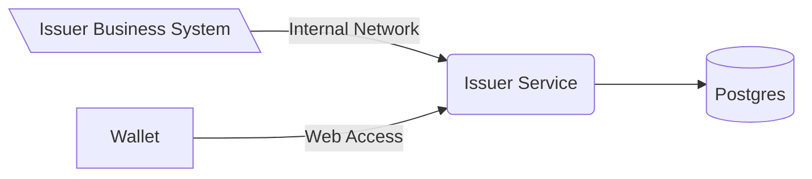
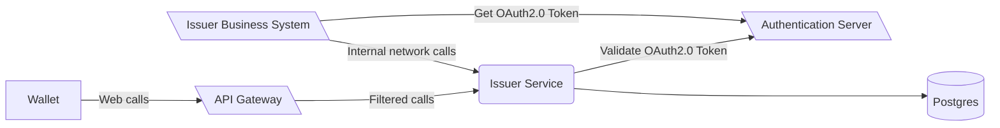
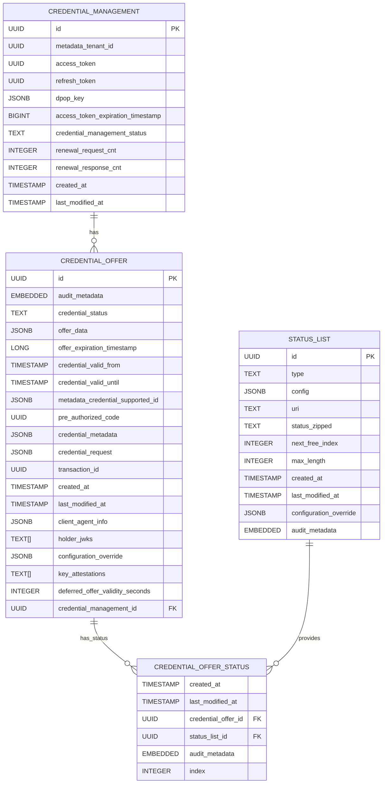
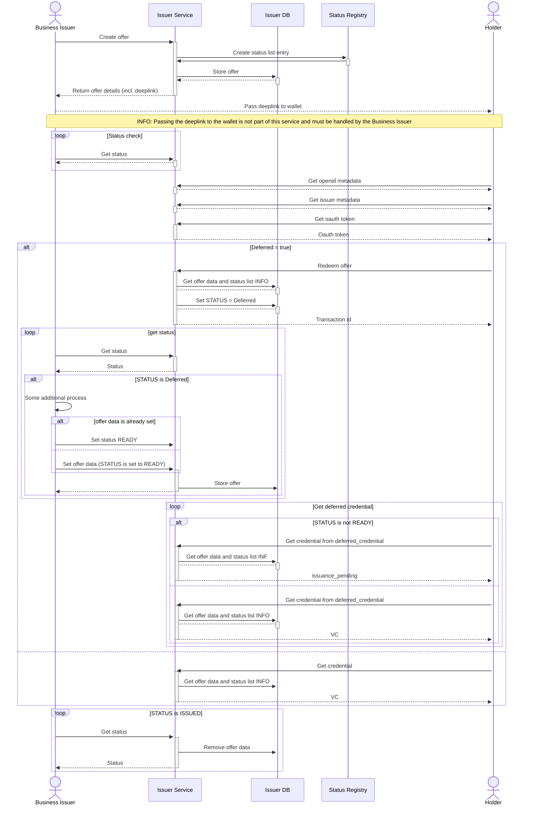
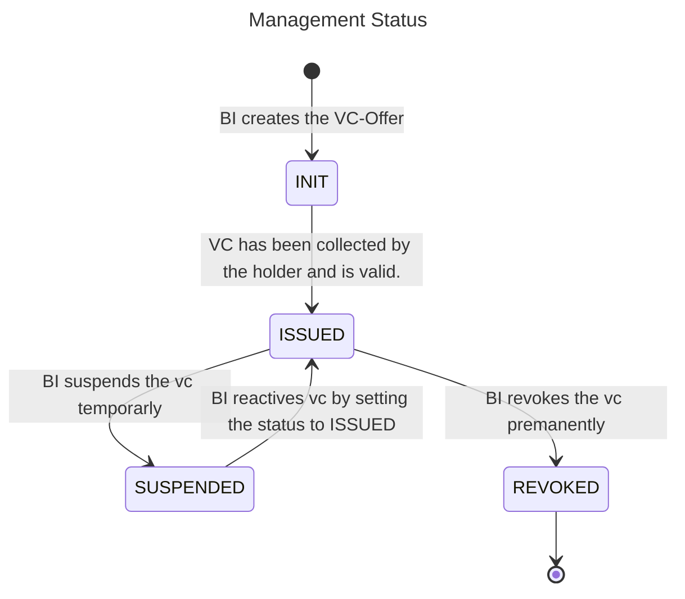
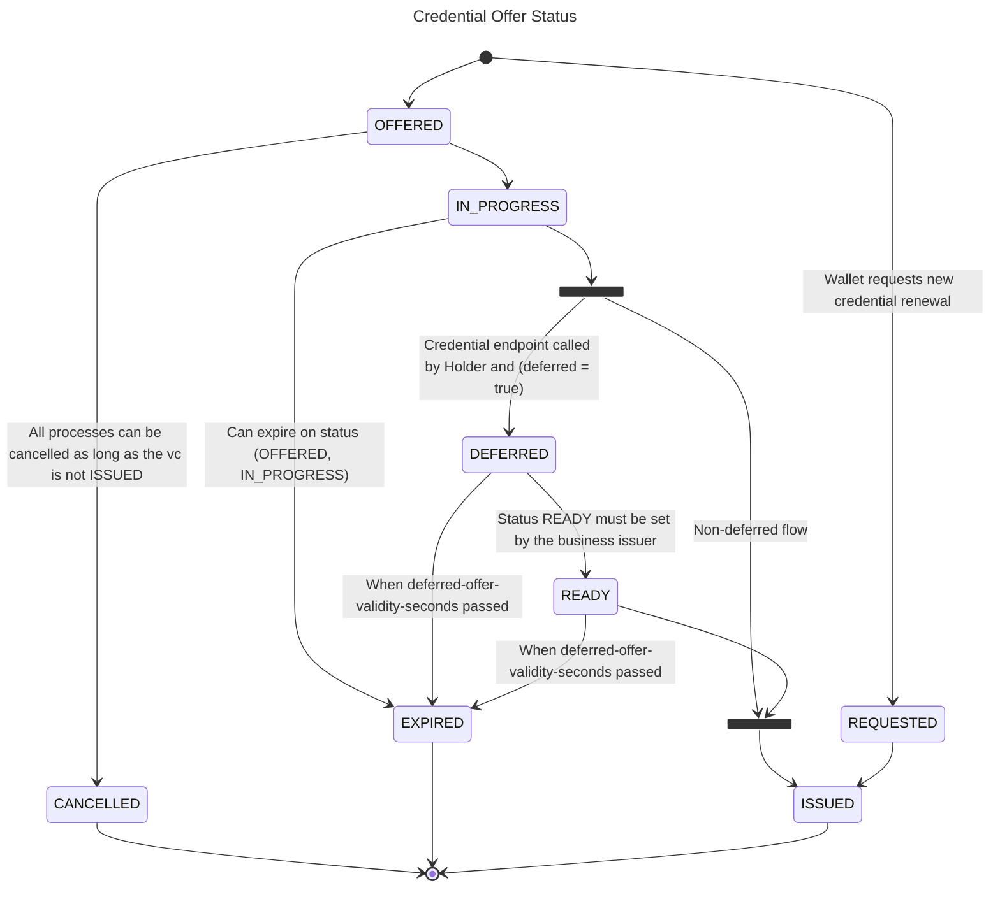

# Generic issuer service

This software is a web server implementing the technical standards as specified in
the [swiyu Trust Infrastructure Interoperability Profile](https://swiyu-admin-ch.github.io/specifications/interoperability-profile/).
Together with the other generic components provided, this software forms a collection of APIs allowing issuance and
verification of verifiable credentials without the need of reimplementing the standards.

The Generic Issuer Service is the interface to offer a credential. It should be only accessible from the
issuers internal organization.

As with all the generic issuance & verification services it is expected that every issuer and verifier hosts their own
instance of the service.

## Table of Contents

- [Architecture Documentation](#architecture-documentation)
- [Overview](#Overview)
- [Deployment](#deployment)
- [Development](#development)
    - [Note on container runtimes](#note-on-container-runtimes)
- [SWIYU](#swiyu)
- [Missing Features and Known Issues](#missing-features-and-known-issues)
- [Contributions and feedback](#contributions-and-feedback)
- [License](#license)

## Architecture Documentation

The detailed architecture documentation can be found
here: [Architecture Generic Issuer](docs/Architecture_generic_issuer.pdf)

## Overview



A possible deployment configuration of the issuer service. Issuer Business System as well as API

# Deployment

> Please make sure that you did the following before starting the deployment:
>
> - Generated the signing keys file with the didtoolbox.jar
> - Generated a DID which is registered on the identifier registry
> - Registered yourself on the swiyuprobeta portal
> - Registered yourself on the api self service portal

## Container image variants

Starting with v3.2.0 we publish **two image variants** to GHCR so existing operators have a
transition period to adopt the hardened runtime:

| Tag pattern                                            | Base image                                                | Entrypoint              | User       | Status                                            |
|--------------------------------------------------------|-----------------------------------------------------------|-------------------------|------------|---------------------------------------------------|
| `ghcr.io/swiyu-admin-ch/swiyu-issuer:<tag>`            | `dhi.io/eclipse-temurin:21-debian13` (hardened, no shell) | `java ...` directly     | `nonroot`  | **Default — recommended**                         |
| `ghcr.io/swiyu-admin-ch/swiyu-issuer:<tag>-unhardened` | `eclipse-temurin:21-jre-ubi9-minimal`                     | `scripts/entrypoint.sh` | UID `1001` | Transitional — will be removed in a later release |

- **New deployments and operators who have completed the migration** should use the default
  (unsuffixed) tag.
- **Operators with pipelines that still depend on the shell-based entrypoint**
  (`HTTP_PROXY`/`HTTPS_PROXY`/`NO_PROXY`, `MY_SPRING_PROFILES`, `JAVA_BOOTCLASSPATH` /
  `/lib` JCE-provider mounts) must pin to the `-unhardened` suffix while they apply the
  changes in [`migration-guides/guide-3.1.x-to-3.2.x.md`](migration-guides/guide-3.1.x-to-3.2.x.md).
- The two `Dockerfile`s in this repository (`Dockerfile.dhi` for the default, `Dockerfile`
  for the `-unhardened` variant) are both built and Snyk-scanned on every PR.

### Verifying image signatures

All published images are signed with [Cosign](https://docs.sigstore.dev/) using keyless
(OIDC) signing directly in the GitHub Actions build workflow. The signature is bound to the
image digest and recorded in the public Sigstore transparency log. You can verify the
authenticity of an image before deploying it:

```bash
cosign verify \
  --certificate-identity-regexp "https://github.com/swiyu-admin-ch/swiyu-issuer/.github/workflows/docker-builder.yml@.*" \
  --certificate-oidc-issuer "https://token.actions.githubusercontent.com" \
  ghcr.io/swiyu-admin-ch/swiyu-issuer:<tag>
```

## 1. Set the environment variables

A sample compose file for an entire setup of both components and a database can be found
in [sample.compose.yml](sample.compose.yml) file.
**Replace all placeholder <VARIABLE_NAME>**.

Please be aware that both the swiyu-issuer-service needs to be publicly accessible over a domain configured
in `EXTERNAL_URL`
so that a wallet can communicate with them.

## 2. Create a verifiable credentials schema

In order to support your use case you need to adapt the so-called issuer_metadata (
see [sample.compose.yml](sample.compose.yml#L85)).
Those metadata define the appearance of the credential in the wallet and what kind of credential formats are supported.
For further information consult the [Cookbooks](https://swiyu-admin-ch.github.io/cookbooks/)

## 3. Initialize the status list

Once the swiyu-issuer-service and postgres instance are up and running you need to initialize the status
list of your issuer so that you can issue credentials with a status.

It is possible to issue credentials without status. Be wary though, as these credentials can not be revoked anymore!

### VCT - verifiable credential type

A verifiable credential in the sd-jwt vc format has a vct claim. The content of this is set through the issuer metadata
for each credential configuration supported entry. The vct can be a string or URL. If it is a URL it should be
resolveable to SD-JWT VC Type Metadata.
When providing a URL, it is recommended to use a subresource
integrity [sri](https://developer.mozilla.org/de/docs/Web/Security/Subresource_Integrity) hash.
The integrity hash is provided with each created credential offer in the offer metadata while issuing the credential.
The integrity can be calculated using shell commands.

`echo "sha256-$(wget -O- http://localhost:8080/oid4vci/vct/my-vct-v01 | openssl dgst -binary -sha256 | openssl base64 -A)"`

```json
{
    "metadata_credential_supported_id": [
        "myIssuerMetadataCredentialSupportedId"
    ],
    "credential_subject_data": {
        "lastName": "Example",
        "firstName": "Edward"
    },
    "offer_validity_seconds": 86400,
    "credential_valid_until": "2030-01-01T19:23:24Z",
    "credential_valid_from": "2010-01-01T18:23:24Z",
    "status_lists": [
        "https://example-status-registry-uri/api/v1/statuslist/05d2e09f-21dc-4699-878f-89a8a2222c67.jwt"
    ]
}
```

> [!NOTE]
> The `metadata_credential_supported_id` must exist in the issuer metadata at
> `/.well-known/openid-credential-issuer` under `credential_configurations_supported`.
> If it does not, the credential request will fail later.
> \
> The `credential_valid_until` and `credential_valid_from` are rounded up and down respectively for improved
> unlinkability.
> Thus the example credential is valid from 2010-01-01T00:00:00Z until 2030-01-01T23:59:59Z.

More details on the vct claim can be found in
the [swiss profile](https://github.com/e-id-admin/open-source-community/blob/main/tech-roadmap/swiss-profile.md#sd-jwt-vc)
and the latest version
of [SD-JWT-based Verifiable Credentials](https://datatracker.ietf.org/doc/draft-ietf-oauth-sd-jwt-vc/). For
compatibility with other ecosystem participants, please use the adoptions as shown in the swiss profile.

### Deployment considerations

Please note that by default configuration the issuer service is set up in a way to easily gain experience with the
issuance process, not as a productive deployment. With the configurations found below, it can be configured and set up
for productive use.

We recommend to not expose the service directly to the web. The focus of the application lies in the functionality of
the issuance. Using API Gateway or Web Application Firewall can decrease the attack surface significantly.

To prevent misuse, the management endpoints should be protected by either by network infrastructure (for example mTLS)
or using OAuth.



# Development

> Please be aware that this section **focus on the development of the issuer service**. For the deployment of
> the component please consult [deployment section](#Deployment).

## Note on container runtimes

For the purpose of integration testing, `@Testcontainers` annotation is used broadly in this repo.
Needless to say, to run [Testcontainers](https://java.testcontainers.org)-based tests, you would need a Docker-API
compatible container runtime.
As Docker has made a few changes to its licensing in the past,
[alternative container runtimes](https://java.testcontainers.org/supported_docker_environment/) started gaining on
popularity.

In general, switching the container runtime from Docker to any other (such as
Podman/[Podman Desktop](https://podman-desktop.io))
for [Testcontainers in Java](https://java.testcontainers.org) usually requires awareness of socket configuration,
cleanup mechanisms,
permissions, and underlying differences.
So, [customizing Docker host detection](https://java.testcontainers.org/features/configuration/#customizing-docker-host-detection)
would be more or less all it takes to make it work.

Luckily, one of the quite popular Docker alternatives featuring pretty seamless integration
is [Podman Desktop](https://podman-desktop.io).
Although the [official manual](https://podman-desktop.io/tutorial/testcontainers-with-podman) suggests otherwise,
from our experience on macOS, it would be sufficient to enable
the [Docker Compatibility](https://podman-desktop.io/docs/migrating-from-docker/managing-docker-compatibility)
feature and the tests would all run through. Furthermore, running `mvn clean install` for the first time would even
implicitly create
a minimalistic [`$HOME/.testcontainers.properties`](https://java.testcontainers.org/features/configuration/), if not
found in your home directory.

## Setup

- Start application IssuerApplication with local profile

    - Starts docker compose for database
    - Runs Flyway migrations if needed

### Updating Openapi Spec

The `openapi.yaml` can be updated by using the generate-doc profile.

```
mvn verify -P generate-doc
```

## Configuration

If you start the application with the local profile as described below, you need to set the credentials for the
status-list api-gateway api in the `application-local.yml` file. The credentials can be obtained from the swiyu
portal. The following properties need to be set:

1. If you have a client key and secret you have to set the following properties in the `application-local.yml` file:

```yaml
swiyu:
    status-registry:
    customer-key: "customer-key"
    customer-secret: "customer-secret"
```

2. If you have a refresh token you have to set the following properties in the `application-local.yml`

```yaml
swiyu:
    status-registry:
        api-url: "https://api-url"
        enable-refresh-token-flow: true
        bootstrap-refresh-token: "your refresh token"
```

> [!NOTE]  
> The values can also be set as environment variables. For more information check
> the [Configuration Environment Variables](#configuration-environment-variables) section.

To start the application locally you can run:

```shell
./mvnw -f issuer-application spring-boot:run -Dspring-boot.run.profiles=local
```

Note: This spins up a local PostgreSQL database via docker. Once running, Openapi-Documentation can be
accessed [here](http://localhost:8080/swagger-ui/index.html#/).

### Generate Keys

Currently only EC 256 keys are used.
Generate private key with:
`openssl ecparam -genkey -name prime256v1 -noout -out ec_private.pem`
Remember to keep private keys private and safe. It should never be transmitted, etc.

On the base registry the public key is published. To generate the public key form the private key we can use
`openssl ec -in private.pem -pubout -out ec_public.pem`

### Configuration Environment Variables

The Generic Issuer service is configured using environment variables.

#### DB Connection

| Variable           | Description                                        |
|:-------------------|:---------------------------------------------------|
| POSTGRES_USER      | Username to connect to the Issuer service Database |
| POSTGRES_PASSWORD  | Password to connect to the Issuer service Database |
| POSTGRES_JDBC      | JDBC Connection string to the shared DB            |
| POSTGRES_DB_SCHEMA | Database Schema to be used, default is `public`    |

#### Verifiable Credential Issuing

| Variable                                         | Description                                                                                                                                                                                                                                                                              |
|:-------------------------------------------------|:-----------------------------------------------------------------------------------------------------------------------------------------------------------------------------------------------------------------------------------------------------------------------------------------|
| EXTERNAL_URL                                     | The URL of the Issuer Signer. This URL is used in the credential offer link sent to the Wallet                                                                                                                                                                                           |
| ISSUER_ID                                        | DID of the Credential Issuer. This will be written to the credential and used during verification                                                                                                                                                                                        |
| CREDENTIAL_OFFER_EXPIRATION_INTERVAL             | The interval in which expired offers are cleared from the storage in the [ISO 8601 duration format](https://en.wikipedia.org/wiki/ISO_8601#Durations). The default value is 15min. This should not be confused with the time an offer is actually valid, which is controlled per request |
| OPENID_CONFIG_FILE                               | JSON file containing the OpenID Connect Configuration of the Issuer. Placeholder replacement is done as described in Config File Placeholders                                                                                                                                            |
| METADATA_CONFIG_FILE                             | The OID4VCI Metadata as a json. Placeholder replacement is done as described in Config File Placeholders. For details on the OID4VCI Metadata consult the OID4VCI Specification.                                                                                                         |
| SDJWT_KEY (Optional - See HSM)                   | The private key used to sign SD-JWT Credentials. The matching public key must be published on the base registry for verification. - Not recommended.                                                                                                                                     |
| DID_SDJWT_VERIFICATION_METHOD                    | The full DID with fragment as used to find the public key for sd-jwt VCs in the DID Document. eg: `did:tdw:<base-registry-url>:<issuer_uuid>#<sd-jwt-public-key-fragment>`                                                                                                               |
| MIN_DEFERRED_OFFER_WAITING_SECONDS               | For the deferred flow. Polling interval for the deferred flow. Defines how long a wallet should wait after receiving the transaction_id until it tries to fetch the actual credential. This value will be shown as `interval` in the deferred response.                                  |
| DEFERRED_OFFER_VALIDITY_SECONDS                  | For the deferred flow. Defines how long (in seconds) an offer can be in the deferred / ready state until it is expired.                                                                                                                                                                  |
| URL_REWRITE_MAPPING                              | Json object for url replacements during rest client call. Key represents the original url and value the one which should be used instead (e.g. {"https://mysample1.ch":"https://somethingdiffeerent1.ch"})                                                                               |
| ENABLE_SIGNED_METADATA                           | Enable signed metadata endpoint at `/.well-known/openid-credential-issuer-signed-metadata`. When enabled, the issuer provides cryptographically signed metadata in addition to the standard unsigned metadata endpoint. Default: `true`.                                                 |
| APPLICATION_SWISS_PROFILE_VERSIONING_ENFORCEMENT | Feature flag for Swiss Profile versioning enforcement. If set to `true`, the service rejects incoming artifacts where applicable if the JWT header is missing `profile_version` or has an unexpected value (e.g. DPoP / key attestation). Default: `false`.                              |

#### Status List

| Variable                                             | Description                                                                                                                                                                                                 | Default  |
|:-----------------------------------------------------|:------------------------------------------------------------------------------------------------------------------------------------------------------------------------------------------------------------|:---------|
| STATUS_LIST_KEY                                      | Private Signing Key for the status list vc, the matching public key should be published on the base registry                                                                                                | _(none)_ |
| DID_STATUS_LIST_VERIFICATION_METHOD                  | Verification Method (id of the public key as in did doc) of the public part of the status list signing key. Contains the whole did:tdw:....#keyFragment                                                     | _(none)_ |
| SWIYU_PARTNER_ID                                     | Your business partner id. This is provided by the swiyu portal.                                                                                                                                             | _(none)_ |
| SWIYU_STATUS_REGISTRY_API_URL                        | The api url to use for requests to the status registry api. This is provided by the swiyu portal.                                                                                                           | _(none)_ |
| SWIYU_STATUS_REGISTRY_TOKEN_URL                      | The token url to get authentication to use the status registry api. This is provided by the swiyu portal.                                                                                                   | _(none)_ |
| SWIYU_STATUS_REGISTRY_CUSTOMER_KEY                   | The customer key to use for requests to the status registry api. This is provided by the api self-service portal.                                                                                           | _(none)_ |
| SWIYU_STATUS_REGISTRY_CUSTOMER_SECRET                | The customer secret to use for requests to the status registry api. This is provided by the api self-service portal.                                                                                        | _(none)_ |
| SWIYU_STATUS_REGISTRY_AUTH_ENABLE_REFRESH_TOKEN_FLOW | Decide if you want to use the refresh token flow for requests to the status registry api. Default: true                                                                                                     | _(none)_ |
| SWIYU_STATUS_REGISTRY_BOOTSTRAP_REFRESH_TOKEN        | The customer refresh token to bootstrap the auth flow for for requests to the status registry api. This is provided by the api self management portal.                                                      | _(none)_ |
| STATUS_LIST_CACHE_TIME                               | Time-to-live for cached status list entries. This value is only set by the issuer, but is used by the cache of the wallet to determine how long a status list should be kept before it is considered stale. | `15m     |
| STATUS_LIST_EXPIRATION_TIME                          | Expiration duration for a status list artifact itself. Represents how long a generated status list remains valid.                                                                                           | `365d    |

#### Trust Registry (optional)

The Trust Registry sidechannel allows the issuer to fetch and cache Identity Trust Statements (idTS) and Protected
Issuance Authorization Trust Statements (piaTS) from the swiyu Trust Registry. This feature is **optional** –
if `SWIYU_TRUST_REGISTRY_API_URL` is not set, trust statement caching is disabled.

| Variable                                       | Description                                                                                                                                                                                                                                                                                                                                                                                                                         | Default  |
|:-----------------------------------------------|:------------------------------------------------------------------------------------------------------------------------------------------------------------------------------------------------------------------------------------------------------------------------------------------------------------------------------------------------------------------------------------------------------------------------------------|:---------|
| SWIYU_TRUST_REGISTRY_API_URL                   | Trust registry API URL (read-only, IF-007). If set, the issuer can fetch its own trust statements. Currently intended for testing purposes only. If not set, trust statement caching is disabled.                                                                                                                                                                                                                                 | _(none)_ |                                                                         | _(none)_ |
| SWIYU_TRUST_REGISTRY_MAX_CACHE_SIZE            | Maximum number of distinct issuer DIDs to cache trust statements for. Prevents unbounded memory growth.                                                                                                                                                                                                                                                                                                                             | `1000`   |
| SWIYU_TRUST_REGISTRY_CLOCK_SKEW_BUFFER_SECONDS | Buffer in seconds subtracted from the JWT `exp` claim before caching. Ensures that served statements are still valid when received by downstream consumers, accounting for clock skew and network latency.                                                                                                                                                                                                                          | `60`     |
| SWIYU_TRUST_REGISTRY_MAX_CACHE_TTL_SECONDS     | Optional hard upper bound for the trust statement cache TTL in seconds. When set, the effective TTL is `min(exp-based TTL, max-cache-ttl-seconds)`. Recommended: set to the same value as `PUBLIC_KEY_CACHE_TTL_MILLI` (converted to seconds) to avoid serving trust statements whose referenced DID key has already been rotated out of the public key cache. If not set, the TTL is derived exclusively from the JWT `exp` claim. | _(none)_ |

#### Refresh functionality

| Variable            | Description                                     |
|:--------------------|:------------------------------------------------|
| ALLOW_TOKEN_REFRESH | Enable OAuth 2.0 refresh token. (Default: true) |

#### Caching

| Variable                       | Description                                                                           |
|:-------------------------------|:--------------------------------------------------------------------------------------|
| MONITORING_BASIC_AUTH_ENABLED  | Enables basic auth protection of the /actuator/prometheus endpoint. (Default: false)  |
| MONITORING_BASIC_AUTH_USERNAME | Sets the username for the basic auth protection of the /actuator/prometheus endpoint. |
| MONITORING_BASIC_AUTH_PASSWORD | Sets the password for the basic auth protection of the /actuator/prometheus endpoint. |

#### Monitoring

| Variable                            | Description                                                                                                                                                                                                                                                                                                                                               | Type | Default       |
|-------------------------------------|-----------------------------------------------------------------------------------------------------------------------------------------------------------------------------------------------------------------------------------------------------------------------------------------------------------------------------------------------------------|------|---------------|
| PUBLIC_KEY_CACHE_TTL_MILLI          | TTL in milliseconds how long a public key result should be cached                                                                                                                                                                                                                                                                                         | int  | 3600000 (1h)  |
| ENCRYPTION_METADATA_CACHE_TTL_MILLI | TTL in milliseconds how long the issuer metadata encryption cache is valid before being evicted on every pod. Rotated keys are kept in the database for a grace period of `2 × encryption-key-rotation-interval` before deletion, so the cache TTL must be strictly less than that grace period. Recommended: roughly one third of the rotation interval. | int  | 300000 (5min) |

#### Security

The management endpoints for both the issuer/verifier (generic component) might seem like they're unprotected and that
there is a lack of controls securing them. This is because they are meant to be used exclusively by the business
issuer/verifier (business component) that are built on top of them by each participant in the ecosystem. The generic
component should be considered closer to a library than to stand-alone services. As such these endpoints are meant to be
deployed in a way where they can only be accessed by the business component of the software. The threat model therefore
excludes attackers being able to send crafted payloads to these management endpoints. If attackers can send anything to
these endpoints, they must have completely taken over the business component and can already do everything.

Management Endpoints can be secured as OAuth2 Resource Server using Spring Security, if required. The generic component
leaves user management to the business component.

For more details see the
official [spring security documentation](https://docs.spring.io/spring-security/reference/servlet/oauth2/resource-server/index.html).

For easy playground setup or when using the component in an isolated zone security starts deactivated. It is activated
when the appropriate environment variables are set.

##### Fixed single asymmetric key

| Variable                                                    | Description                                                                                                                                                                                        | Type                             |
|-------------------------------------------------------------|----------------------------------------------------------------------------------------------------------------------------------------------------------------------------------------------------|----------------------------------|
| SPRING_SECURITY_OAUTH2_RESOURCESERVER_JWT_PUBLICKEYLOCATION | URI path to a single public key in pem format. [See Details](https://docs.spring.io/spring-security/reference/servlet/oauth2/resource-server/jwt.html#oauth2resourceserver-jwt-decoder-public-key) | URI eg: file:/app/public-key.pem |

##### Authorization Server

| Variable                                                | Description                                                                                                                                                                                                                                                                        | Type         |
|---------------------------------------------------------|------------------------------------------------------------------------------------------------------------------------------------------------------------------------------------------------------------------------------------------------------------------------------------|--------------|
| SPRING_SECURITY_OAUTH2_RESOURCESERVER_JWT_ISSUERURI     | URI to the issuer including path component. Will be resolved to <issuer-uri>/.well-known/openid-configuration to fetch the public key [See Details](https://docs.spring.io/spring-security/reference/servlet/oauth2/resource-server/jwt.html#_specifying_the_authorization_server) | URI / String |
| SPRING_SECURITY_OAUTH2_RESOURCESERVER_JWT_JWKSETURI     | URI directly to fetch directly the jwk-set instead of fetching the openid connect first.                                                                                                                                                                                           | URI / String |
| SPRING_SECURITY_OAUTH2_RESOURCESERVER_JWT_JWSALGORITHMS | List of algorithms supported for the key of the jkw-set. Defaults to only RS256.                                                                                                                                                                                                   | String       |

Other properties as defined by spring can be used.

Multitenancy is not supported.

#### JWT Based Data Integrity

If there is the need to further protect the API / Data Integrity it is possible to enable the feature with a flag and
set the environment variables with the allowed public key as a JSON Web Key Set

| Variable                  | Description                                                                                                                                                                                                                     |
|:--------------------------|:--------------------------------------------------------------------------------------------------------------------------------------------------------------------------------------------------------------------------------|
| ENABLE_JWT_AUTH           | Enables the requirement of writing calls to the issuer service to be signed JWT                                                                                                                                                 |
| JWKS_ALLOWLIST (Optional) | When ENABLE_JWT_AUTH is set to true with this property the public keys authorized to perform a writing call can be set as a Json Web Key set according to [RFC7517](https://datatracker.ietf.org/doc/html/rfc7517#appendix-A.1) |

```
    ENABLE_JWT_AUTH=true
    JWKS_ALLOWLIST={"keys":[{"kty":"EC","crv":"P-256","kid":"testkey","x":"_gHQsZT-CB_KvIfpvJsDxVSXkuwRJsuof-oMihcupQU","y":"71y_zEPAglUXBghaBxypTAzlNx57KNY9lv8LTbPkmZA"}]}
```

If the JWT based authentication is activated, all calls must be wrapped in a signed JWT with the claim "data" other
calls will be rejected. The value of the data claim will contain the full json body of the normal request.

Note that this is only affects writing calls.

#### Data Integrity Check

To provide a data integrity check with the issuer it is possible to provide the credential subject data as JWT.

See [CredentialOfferCreateJWTIT.java](issuer-application/src/test/java/ch/admin/bj/swiyu/issuer/management/infrastructure/web/controller/CredentialOfferCreateJwtIT.java)
for examples on how to use.

The keys are also set with the environment variable `JWKS_ALLOWLIST`.

The Data integrity check can be enforced to be always used by setting the environment variable.

| Variable                | Description                                                                                                                              |
|:------------------------|:-----------------------------------------------------------------------------------------------------------------------------------------|
| DATA_INTEGRITY_ENFORCED | Enforce to always do the data integrity check. This will break all existing offers which have been offered without data integrity check! |

#### Kubernetes Vault Keys

| Variable                                             | Description                                                                                                                                         |
|------------------------------------------------------|-----------------------------------------------------------------------------------------------------------------------------------------------------|
| secret.db.username                                   | Username to connect to the Issuer Service Database.                                                                                                 |
| secret.db.password                                   | Password to connect to the Issuer Service Database                                                                                                  |
| secret.key.sdjwt.key                                 | Private Key used to sign jwt_vc / SD-JWT Verifiable Credentials                                                                                     |
| secret.key.status-list.key                           | Private Signing Key for the status list vc, the matching public key should be published on the base registry                                        |
| secret.swiyu.status-registry.customer-key            | The customer key to use for requests to the status registry api. This is provided by the api self-service portal.                                   |
| secret.swiyu.status-registry.customer-secret         | The customer secret to use for requests to the status registry api. This is provided by the api self-service portal.                                |
| secret.swiyu.status-registry.bootstrap-refresh-token | The customer refresh token to bootstrap the auth flow for for requests to the status registry api. This is provided by the api self-service portal. |

#### HSM - Hardware Security Module

For operations with an HSM, the keys need not be mounted directly into the environment running this application.
Instead, a connection is created to the HSM via JCA. This can be with
the [Sun PKCS11 provider](https://docs.oracle.com/en/java/javase/22/security/pkcs11-reference-guide1.html) or a vendor
specific option.
Note that for creating the keys it is expected that the public key is provided as self-signed certificate.

For vendor specific options it is necessary to provide the library in the Java classpath. How
you do this depends on the image variant you deploy (see
[Container image variants](#container-image-variants)):

- **Default hardened image** (`dhi.io`-based, distroless-style, no shell) — the entrypoint
  invokes `java` directly, so a classpath directory cannot be expanded at startup. Vendor
  JARs must be baked into a derived image and referenced explicitly via `-Xbootclasspath/a:`,
  and vendor PKCS#11 native libraries (`.so`) need their transitive C-runtime dependencies
  staged in because the hardened base image strips them. Ready-made example Dockerfiles for
  both common setups are in [`examples/hsm/`](examples/hsm/):
    - [`examples/hsm/Dockerfile.sunpkcs11`](examples/hsm/Dockerfile.sunpkcs11) — JDK-bundled
      SunPKCS11 bridge against a vendor module (SoftHSM2, Thales Luna, nCipher, ...).
    - [`examples/hsm/Dockerfile.securosys`](examples/hsm/Dockerfile.securosys) — Securosys
      Primus JCE provider via the vendor JAR.

  The pattern (multi-stage build to stage native libs into `/app/lib-native/`, vendor JAR
  baked into `/app/lib-ext/`, explicit `-Xbootclasspath/a:` in `ENTRYPOINT`) and the common
  pitfalls are documented in
  [`migration-guides/v2.x-to-v3.0.0.md` §4](migration-guides/guide-3.1.x-to-3.2.x.md).

- **Unhardened `-unhardened` image** (transitional) — the shell entrypoint still expands
  `${JAVA_BOOTCLASSPATH}` (default `./lib`) into `-Xbootclasspath/a:...`, so mounting a
  volume that contains the vendor JARs at `/app/lib` keeps working as before.

| Variable                      | Description                                                                                                                                                                                |
|-------------------------------|--------------------------------------------------------------------------------------------------------------------------------------------------------------------------------------------|
| SIGNING_KEY_MANAGEMENT_METHOD | This variable serves as selector. `key` is used for a mounted key. `pkcs11` for the sun pkcs11 selector. For vendor specific libraries the project must be compiled with these configured. |
| HSM_HOST                      | URI of the HSM Host or Proxy to be connected to                                                                                                                                            |
| HSM_PORT                      |                                                                                                                                                                                            |
| HSM_USER                      | User for logging in on the host                                                                                                                                                            |
| HSM_PASSWORD                  | Password for logging in to the HSM                                                                                                                                                         |
| HSM_PROXY_USER                |                                                                                                                                                                                            |
| HSM_PROXY_PASSWORD            |                                                                                                                                                                                            |
| HSM_USER_PIN                  | For some proprietary providers required pin                                                                                                                                                |
| HSM_KEY_ID                    | Key identifier or alias, or label when using pkcs11-tool                                                                                                                                   |
| HSM_KEY_PIN                   | Optional pin to unlock the key                                                                                                                                                             |
| HSM_STATUS_KEY_ID             | Key identifier or alias, or label when using pkcs11-tool for status list key. If not set will use HSM_KEY_ID                                                                               |
| HSM_STATUS_KEY_PIN            | Optional pin to unlock the status list key. If not set will use HSM_KEY_PIN                                                                                                                |
| HSM_CONFIG_PATH               | File Path to the HSM config file when using [Sun PKCS11 provider](https://docs.oracle.com/en/java/javase/22/security/pkcs11-reference-guide1.html)                                         |

### Config Files

Config Files can be mounted in the container. For further details please refer to the cookbooks.

#### Config File Templating

The content of the metadata json files, among these METADATA_CONFIG_FILE and OPENID_CONFIG_FILE can be annotated with
template values.
By default, the external-url can be always used.

```
{
  "issuer": "${external-url}",
  "token_endpoint": "${external-url}/oid4vci/token"
}
```

Using Spring environment variables arbitrary environment variables can be used for the templating.

Let's say we want to add a prefix to the display name for your VC depending on the environment your issuer runs on.
This can be achieved by adding in a template value, which is in essence an arbitrary string decorated by ${}.
In this case we choose "stage". The environment variables are all in caps. See
the [official Spring documentation](https://docs.spring.io/spring-boot/docs/2.6.1/reference/html/features.html#features.external-config.typesafe-configuration-properties.relaxed-binding.environment-variables)
for further information.

```
...
      "display": [
        {
          "name": "${stage}MyCredential",
...
```

In our deployment we can set the value by adding in the environment variable
`APPLICATION_TEMPLATEREPLACEMENT_STAGE=dev-`

#### Allowed Issuer Metadata config values

> The paths specified below are referring to the json structure of the credential issuer metadata as specified in
>
the [OpenID4VCI specification](https://openid.net/specs/openid-4-verifiable-credential-issuance-1_0-ID1.html#section-11.2.3)

| Config path                                                                   | Allowed values                                                   | Required | Comment                                                   |
|-------------------------------------------------------------------------------|------------------------------------------------------------------|----------|-----------------------------------------------------------|
| version                                                                       | "1.0"                                                            | Yes      |                                                           |
| credential_configurations_supported.*.format                                  | "dc+sd-jwt" / "vc+sd-jwt" (deprecated)                           | Yes      |                                                           |
| credential_configurations_supported.*.credential_signing_alg_values_supported | ["ES256", "Ed25519"]                                             | Yes      | Must be matching the configured singing key               |
| credential_configurations_supported.*.proof_types_supported                   | ``` "jwt": {"proof_signing_alg_values_supported": ["ES256", "Ed25519"]} ``` | No       | When set must be ES256 Ed25519 or both         |
| credential_configurations_supported.*.cryptographic_binding_methods_supported | ["jwk"]                                                          | No       |                                                           |

The configuration `proof_types_supported` allows specifying the required security specification the wallet should store
key material in for the credential. This value is provided alongside `proof_signing_alg_values_supported`.
Use of `key_attestation_required` is optional.

Example value

```
"proof_types_supported": {
        "jwt": {
          "proof_signing_alg_values_supported": [
            "ES256",
            "Ed25519"
          ],
          "key_attestations_required": {
            "key_storage": ["iso_18045_high"]
          }
        }
      }
```

The value of `key_attestation_required` can be an empty json object `{}`. This requests a key attestation to provided,
but leaves the choice of security level up to the wallet.
A key attestation is proof created by a service (henceforth called attestation service) attesting the wallets key has
been created according to a given security standard.
We as issuer have to trust this attestation service. For more details about key attestations refer to the OID4VCI
specification
or other online resources like for example
the [android documentation](https://developer.android.com/privacy-and-security/security-key-attestation).

| Supported key_storage Value | Description                                                                                                                                                                                                                                            |
|-----------------------------|--------------------------------------------------------------------------------------------------------------------------------------------------------------------------------------------------------------------------------------------------------|
| iso_18045_enhanced-basic	   | Key storage is resistant to attack with attack potential "Enhanced-Basic", equivalent to VAN.3 according to ISO 18045. This is the case if TEE is used.                                                                                                |
| iso_18045_high              | Key storage is is resistant to attack with attack potential "High", equivalent to VAN.5 according to ISO 18045. This is the case if Strongbox/Secure enclave is used. Please note that no backup of credentials issued with this security can be made. |

It is possible to limit key attestation providers by their DID. This can be configured with providing a list of trusted
attestation issuers.
If an empty array is provided (default) the key attestation is trusted from any issuer.
The attestations integrity and signature are checked in every case.

| Variable                      | Description                                                                                                                                                                                                                | Default |
|-------------------------------|----------------------------------------------------------------------------------------------------------------------------------------------------------------------------------------------------------------------------|---------|
| TRUSTED_ATTESTATION_PROVIDERS | This array of strings contains dids (used in JWT "iss" claim) to be trusted for the key attestation. Is only used if key attestations are demanded for the credential issued. If not set, key attestations cannot be used. | []      |

#### VC Metadata provisioning

In some simpler deployments no content delivery network is available to provide credential metadata for things like
vct (verifiable credential type), json schemas or overlays capture architecture. In this case the desired files can be
mounted in similar fashion to the issuer metadata.
A significant difference is though that the file locations are specified ad-hoc with spring environment variables as
documented in [Config File Templating](#config-file-templating)

Placeholders in these files will be replaced as well.

| Variable Map                                          | Destination                        |
|-------------------------------------------------------|------------------------------------|
| APPLICATION_VCTMETADATAFILES_                         | $EXTERNAL_URL/oid4vci/vct/         |
| APPLICATION_JSONSCHEMAMETADATAFILES_                  | $EXTERNAL_URL/oid4vci/json-schema/ |
| APPLICATION_OVERLAYSCAPTUREARCHITECTUREMETADATAFILES_ | $EXTERNAL_URL/oid4vci/oca/         |

For example, we could use the file `/cfg-files/vct-test.json` by setting
`APPLICATION_VCTMETADATAFILES_TESTV1=file:/cfg-files/vct-test.json`.
The content of vct-test.json will then be available at `$EXTERNAL_URL/vct/testv1`

#### Webhook Callbacks

For the business-issuer it can be useful to have up-to-date information about offered credentials.
It is possible to configure a Webhook Callback endpoint, optionally secured by API Key. Please note that delivery of
callback events will be retried until successful, to guarantee an at-least-once delivery.
Failed deliveries will create error logs and be retried in the next interval.

| Variable               | Description                                                                                                                                                                             |
|------------------------|-----------------------------------------------------------------------------------------------------------------------------------------------------------------------------------------|
| WEBHOOK_CALLBACK_URI   | Full URI of the REST endpoint where webhooks shall be sent to. No Callback events will be created if not set.                                                                           |
| WEBHOOK_API_KEY_HEADER | (Optional) API key header, if the callback uri has a api key for protection. Will be used as HTTP header key.                                                                           |
| WEBHOOK_API_KEY_VALUE  | (Optional, Required if WEBHOOK_API_KEY_HEADER is set) The API key used.                                                                                                                 |
| WEBHOOK_INTERVAL       | How often the collected events are sent. Value interpreted as milliseconds if given a plain integer or an [ISO 8601 duration format](https://en.wikipedia.org/wiki/ISO_8601#Durations). |

Callbacks will be sent on change of VC state, such as when the VC is issued to a holder or is deferred.
Errors which concern the issuing process also create callbacks.

Callback Object Structure

| Field             | Description                                                                                                            |
|-------------------|------------------------------------------------------------------------------------------------------------------------|
| subject_id        | ID of the element the callback is about. For now the management id of the credential                                   |
| event_type        | VC_STATUS_CHANGED or ISSUANCE_ERROR                                                                                    |
| event             | The new VC state if event_type is VC_STATUS_CHANGED. If ISSUANCE_ERROR one of OAUTH_TOKEN_EXPIRED or KEY_BINDING_ERROR |
| event_description | Human readable details.                                                                                                |
| timestamp         | timestamp the event occurred. Can differ from the time it is sent.                                                     |

### Adding certificates to the image via the `certs` directory

To add additional CA or TLS certificates to the application image, place PEM encoded files into the project `certs`
directory (path: `./certs`) and rebuild the image. Certificates must end with `crt`. Do not store private keys
in `certs`.

Steps:

1. Copy one or more `.crt` files to `./certs` (e.g. `my-ca.pem`).
2. Rebuild the Docker image so the files are included.
3. Certificates are imported into the truststore during image build.

## Data Structure



Note: Status List info comes from config and are populated to the DB the first time a Credential uses the status.
ID of the credential offer is also the id used by the issuer adapter (the component communicating with the issuer
service)
to revoke the credential. It is returned when a new offer is created. It's recommended to save this id to
revoke the credential later on.

## Credential flows



## Credential Flow Api details

To get more information about the different calls please check the detail documentations:

* [Credential issuance flow](./issuance.md)
* [Deferred issuance flow](./deferred.md)

## Credential Management Status

Status diagram for the management status of a credential. This status manages the overall lifecycle of a credential.
If this status is changed all related status list entries are updated accordingly.



## Credential Status

The credential status manages the state of a single credential offer and can influence the issuance process.



## SWIYU

### Status registry

To use the swiyu status registry to host your status lists you need a registration via ePortal to the swiyu ecosystem.
To get the appropriate credentials please visit the swiyu portal application on ePortal.

For access to the swiyu api you need a refresh token along with your other credentials, please see the `SWIYU_*`
environment variables for further details.

The refresh token can only be used one time, but don't worry: the application does manage the refresh tokens itself.
But if your issuer service does not run for over a week it might be possible that the refresh token
saved in the database is no longer valid and cannot be used to start the api auth flow.
If this is the case you need to manually create a new refresh token in the api self-service portal and bootstrap your
issuer service with this token.
The application does log an appropriate error if it detects such an issue but will still start up.
Updates to the status registry will fail as long as the auth flow is not restarted with a valid bootstrap token.

### Latest development

The current default implementation of the issuer service is based on
the [OID4VCI specs DRAFT 13](https://openid.net/specs/openid-4-verifiable-credential-issuance-1_0-ID1.html).
But there are already some features from
the [OID4VCI 1.0](https://openid.net/specs/openid-4-verifiable-credential-issuance-1_0.html) implemented for
example the:

* new credential-endpoint (with corresponding response)
  defined [here](https://openid.net/specs/openid-4-verifiable-credential-issuance-1_0.html#name-credential-endpoint)
* new deferred credential endpoint
  defined [here](https://openid.net/specs/openid-4-verifiable-credential-issuance-1_0.html#name-deferred-credential-endpoin)

These endpoints can be used if the custom header `SWIYU-API-Version=2` is set in the request. These endpoints are not
yet pen-tested.

#### Setup a local environment

1. Navigate to ePortal
2. Search and select the application **swiyu pro beta**
3. Create a new business partner (scroll to bottom of AGBs)
4. Navigate again to ePortal
5. Search and select the application **API Selfservice Portal**
6. Select the API **swiyucorebusiness_status**
7. Click the blue button "Abonnieren Sie"
8. Create a new application for this instance
9. Use Customer Key & Secret to configure application-local.yml
10. Onboard via API Gateway (TODO)

## Docker Image Tagging Strategy

Docker images for this project follow a formalized environment-based tagging approach:

| Tag     | Meaning                | Description                                                                                 |
|---------|------------------------|---------------------------------------------------------------------------------------------|
| dev     | Development Build      | Latest commit from the development branch. Automatically generated on every push to `main`. |
| staging | Integration Test Build | Set at the end of a sprint or after completion of a feature for integration testing.        |
| rc      | Release Candidate      | Frozen state prior to release and penetration testing.                                      |
| stable  | Verified Production    | Released after successful QA and penetration testing.                                       |

These tags are assigned automatically or manually as part of the CI/CD workflow. This ensures that environments can
reliably reference images by their lifecycle stage (e.g., `swiyu-issuer-service:staging`) without requiring manual
version management.

### Promotion Workflow

The image promotion process follows these steps:

```text
[Commit → dev]
    ↓    build & push :dev
[Feature completed / Sprint end]
    ↓    promote → :staging
[Release candidate created]
    ↓    promote → :rc
[QA & penetration test passed]
    ↓    promote → :stable
```

## Release Process and Versioning

### Semantic Versioning (SemVer)

This project follows Semantic Versioning (SemVer) to make it easy to understand the impact of a software release just by
looking at the version number. Our version numbers follow the format:

```
MAJOR.MINOR.PATCH[-rc][+BUILD]
```

### Version Components

#### MAJOR version (X.y.z)

- Incremented when we Contract the system by removing, changing, or breaking existing features
- Example: Removing a deprecated endpoint, changing response formats in a non-compatible way

#### MINOR version (x.Y.z)

- Incremented when we Extend the system with new, backward-compatible functionality
- Example: Adding a new endpoint, introducing an optional field, or extending valid inputs

#### PATCH version (x.y.Z)

- Incremented when we Maintain the system with backward-compatible security fixes on Release Branch
- Example: Security bug fixes or important performance optimizations needed on the last Release

### Release Candidates

Release Candidates (RCs) are tagged as prereleases to indicate a build that is a candidate for the next official
release:

- Format: x.y.z-rc.N (e.g., 1.4.0-rc.1, 1.4.0-rc.2)
- Used for testing, validation, and final quality assurance
- Once validated, the RC suffix is dropped for the official release
- Example: 1.4.0-rc.1, 1.4.0-rc.2 → 1.4.0 (final release)

### Release Workflow

Our release process follows these principles:

Version Contract: If you upgrade within the same MAJOR version, your existing integrations will continue to work (
following the Expand and Migrate Pattern)

GitHub Pre-release Tagging:

- All versions with -rc.N suffix (e.g., 2.1.0-rc.1) are published as GitHub Prereleases
- Prereleases are meant for testing, staging, and final validation
- After validation, we remove the -rc suffix and publish the official release (e.g., 2.1.0)
- Official releases are not marked as pre-releases on GitHub

## Missing Features and Known Issues

The swiyu Public Beta Trust Infrastructure was deliberately released at an early stage to enable future ecosystem
participants. The [feature roadmap](https://github.com/orgs/swiyu-admin-ch/projects/1/views/7) shows the current
discrepancies between Public Beta and the targeted productive Trust Infrastructure. There may still be minor bugs or
security vulnerabilities in the test system. These are marked as [‘KnownIssues’](../../issues) in each repository.

## Contributions and feedback

We welcome any feedback on the code regarding both the implementation and security aspects.
Please follow the guidelines for contributing found in [CONTRIBUTING.md](/CONTRIBUTING.md).

## License

This project is licensed under the terms of the MIT license. See the [LICENSE](/LICENSE) file for details.
