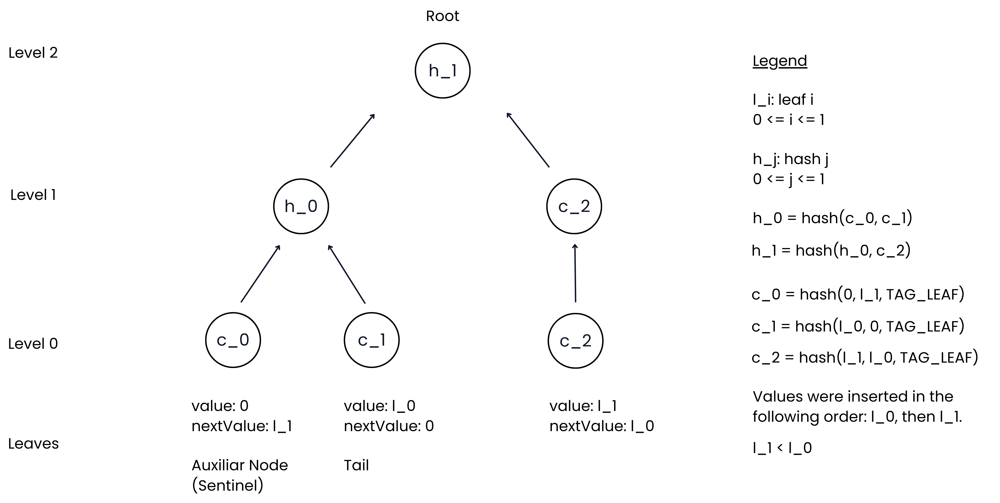

# LeanIMT+: Efficient Merkle Tree for Membership and Non-Membership Proofs

LeanIMT+ is an optimized Incremental Merkle Tree designed to support efficient membership **and non-membership** proofs.

Inspired by:

- LeanIMT[^leanimt]
- Indexed Merkle Tree[^imt-paper] [^aztec-docs]

The result is a simple structure that allows:

- Efficient incremental insertions
- Compact membership proofs
- Efficient non-membership proofs
- Post-quantum safety (assuming the underlying hash function is post-quantum secure)

## Motivation

LeanIMT+ was built to provide an **efficient non-membership construction for revocation in verifiable credentials**, one of the takeaways of the **Revocation in zkID: Merkle Tree-based Approaches**[^revocation-zkid] research. The goal is to prove a credential is _not_ revoked without scanning the whole set.

The two most popular options both have drawbacks: Sparse Merkle Trees (SMT) need a large tree depth (typically 128 or more), which is expensive in ZK because every proof must perform that many hashes, while Indexed Merkle Trees use a standard, fixed-depth Merkle tree padded with empty (zero-hash) leaves in the unused positions.

LeanIMT+ keeps the indexed-leaf linked-list trick from the Indexed Merkle Tree ("low leaf" non-membership) but builds it on the **LeanIMT** construction, so the depth stays **dynamic** and there are **no zero hashes**.

Keep in mind that solving non-membership is always less efficient than the most optimized way to solve membership alone. So if you only need membership proofs, use LeanIMT. If you also need non-membership proofs, use LeanIMT+.

## Overview

LeanIMT+ is a sorted incremental Merkle tree where:

- Leaves are linked together in **sorted order** by `value`.
- Each leaf stores two fields, `value` and `nextValue`. Leaves are linked by value rather than by an explicit pointer: a leaf whose `nextValue` is `v` refers to the leaf whose `value` is `v`.
- Each leaf commits to its data as `leafHash = H_leaf(value, nextValue, TAG_LEAF)`, a **3-input** hash that is domain-separated from the 2-input internal-node hash (see [Implementation details](#Implementation-details)).
- The base layer of the tree is the list of these leaf commitments.
- Parent nodes follow the LeanIMT construction: `parent = H_internal(left, right)`. When a level has an odd number of nodes, the unpaired node is promoted unchanged to the next level (no zero hash, no extra hash call).

Rules:

- `0` is **not** a valid value.
- `0` is used only as a sentinel value and as the end-of-list marker: the last leaf in the linked list always has `nextValue = 0`.

All LeanIMT+ operations are logarithmic in the number of leaves $n$, that is $O(\log n)$.

In most real-world applications the leaf values are public: users fetch them to rebuild the tree locally and compute their own Merkle proofs.

### Leaf states

A leaf record is just `{ value, nextValue }`. Its _state_ is encoded purely by those two fields; there is no separate type tag:

| State         | `value` | `nextValue`                                 | Where                          |
| ------------- | ------- | ------------------------------------------- | ------------------------------ |
| **sentinel**  | `0`     | smallest real value (`> 0`)                 | always physical index `0`      |
| **active**    | `> 0`   | next-larger value, or `0` if it is the tail | any index `≥ 1`                |
| **tombstone** | `0`     | `0`                                         | a slot left behind by `remove` |

## Sentinel Leaf

The first leaf in the tree is always a sentinel:

```
value     = 0
nextValue = (smallest user value)
```

The sentinel is created together with the first user insertion. It allows non-membership proofs for any value smaller than the smallest user value.

Example after inserting `5, 10, 20`:

```
sentinel        first              middle          tail
(value, next)   (value, next)      (value, next)   (value, next)
[0, 5]          [5, 10]            [10, 20]        [20, 0]
```

## Construction

1. Each leaf commits to its data: `leafHash = H_leaf(value, nextValue, TAG_LEAF)`.

2. These hashes form the base layer of the tree.

3. Parent nodes follow the LeanIMT construction: `parent = H_internal(leftChild, rightChild)`. Unpaired (odd) nodes are promoted unchanged to the level above.

This produces the final Merkle root.



## Insertion

To insert a new value `v`:

1. **Locate the low leaf**

   Find the active leaf `L` such that `L.value < v` and either `L.nextValue > v` or `L` is the tail. This is the **predecessor** of `v` in sorted order. The implicit linked list defines this leaf logically; the lookup itself is served by an auxiliary ordered index (AVL by default) in $O(\log n)$. See [Implementation details](#Implementation-details).

2. **Append the new leaf**

   Append the new leaf at a fresh physical slot. The new leaf inherits `L`'s old `nextValue`.

3. **Rewire the low leaf**

   Update `L` so its `nextValue` points at the new value.

4. **Recompute hashes**

   Recompute only what changed:
   - the new leaf's commitment,
   - the low leaf's commitment,
   - every parent up to the root that depends on those two leaves.

Example, inserting `7` into a tree containing `5, 10`:

```
before
[0, 5] [5, 10] [10, 0]

insert 7

after
[0, 5] [5, 7] [10, 0] [7, 10]
```

(The new leaf is appended at the end _physically_, but logically sits between `5` and `10` in the sorted linked list.)

## Removal

Removal does not physically delete a leaf. Merkle positions are addressable, so the slot stays but is **tombstoned** to `{0, 0}`. Its commitment becomes the canonical tombstone commitment `H_leaf(0, 0, TAG_LEAF)`. The slot is never reused: once removed it stays a tombstone for the life of the tree, and later inserts always append a fresh slot.

Before tombstoning, the linked list is repaired: the predecessor of the removed value takes over the removed leaf's `nextValue`, so the sorted list stays intact.

## Membership Proof

To prove that value `v` **is** in the tree:

1. Locate the leaf containing `value = v` (via the ordered index).

2. Generate a standard Merkle proof for that leaf using the LeanIMT structure.

To verify the Merkle proof, check that:

- The leaf's commitment equals `H_leaf(leaf.value, leaf.nextValue, TAG_LEAF)`.
- The Merkle path reconstructs the root.
- `leaf.value === v`.

## Non-Membership Proof

To prove that value `v` is **not** in the tree:

1. **Find the low leaf**

   Find the leaf `L` such that `L.value < v` and either `L.nextValue > v` or `L` is the tail (`L.nextValue = 0`). If `v` is smaller than every active value, the low leaf is the sentinel at index `0`.

2. **Generate a Merkle proof for `L`**

   Same shape as a membership proof, but the proof is for `L`, not for `v` itself.

3. **Verify the Merkle proof**

   Check that:
   - The Merkle proof of `H_leaf(L.value, L.nextValue, TAG_LEAF)` reconstructs the root.
   - The ordering condition: `L.value < v` AND (`L.nextValue > v` OR `L.nextValue = 0`).
   - The **tombstone replay guard**: a leaf with `value = 0` is only
     valid as a low leaf at index `0` (the sentinel). Any other
     `value = 0` leaf is a tombstone and is rejected.

   If all hold, `v` cannot exist in the tree without breaking the sorted-list invariant.

### Unified proof generation

Both cases produce a single proof type, discriminated by a flag marking it as membership or non-membership, so they flow through the same verification logic.

## Implementation details

These are properties of the reference implementation rather than the abstract construction. They are the choices made in the implementation, but each one could be swapped for a different option.

### Domain-separated hashing (second-preimage protection)

Leaf and internal nodes use **different hash arities**:

- Leaf commitment: `H_leaf(value, nextValue, TAG_LEAF)` (3 inputs).
- Internal node: `H_internal(left, right)` (2 inputs).

`TAG_LEAF` is a constant (default `1`) mixed into every leaf hash. The different arity plus the tag act as **domain separation**: a leaf commitment can never coincide with an internal-node hash. This prevents a general second-preimage attack in which an attacker repackages an internal node as a leaf (or vice versa) to forge a proof. The leaf and internal hash functions are supplied separately, so each layer uses its own dedicated hash.

### Ordered index for predecessor lookups (AVL by default)

The "walk the linked list" description is _logical_. Walking the implicit list would be $O(n)$ per insert and per proof. Instead, an auxiliary **ordered index** keyed by `value` answers `find` and `predecessor` queries, which is exactly what insertion, removal and non-membership proofs need.

The default index is a self-balancing **AVL tree** ($O(\log n)$ find / predecessor / insert / remove).

The index is pluggable: a red-black tree, B-tree, B+ tree, or any other ordered structure can be used in place of the AVL tree without touching the tree logic.

## Benchmarks

LeanIMT+ was benchmarked against a Sparse Merkle Tree (SMT). Off-chain (JS/TS), in our benchmark suite, LeanIMT+ was faster on every measured operation. In-circuit (Circom), it uses fewer constraints at every tree depth.

LeanIMT+ relates to the Indexed Merkle Tree much as LeanIMT relates to the Incremental Merkle Tree: dynamic depth and no zero hashes, though its non-membership proof differs in some details. For those details, see the Indexed Merkle Tree paper[^imt-paper] and the Aztec article[^aztec-docs]; for the underlying benchmarks, see the LeanIMT paper[^leanimt].

### Running the benchmarks

All benchmark code is in the repository, so every number below can be reproduced and extended. The README files include step-by-step instructions for running both the off-chain (JS/TS) and in-circuit (Circom) suites. The repository also contains many more benchmarks than the ones shown here, covering additional operations and tree sizes.

GitHub repository: https://github.com/vplasencia/leanimt-plus

Off-chain, mean time per operation at a tree of 2048 leaves:

| Operation               | SMT (ms) | LeanIMT+ (ms) |
| ----------------------- | -------- | ------------- |
| Insert                  | 2.47     | 0.93          |
| Generate membership     | 0.95     | 0.00066       |
| Verify membership       | 5.13     | 1.57          |
| Generate non-membership | 0.91     | 0.00081       |
| Verify non-membership   | 5.27     | 0.27          |

In-circuit, non-linear constraints by tree depth:

| Depth | LeanIMT+ | SMT   | Ratio |
| ----- | -------- | ----- | ----- |
| 2     | 2,031    | 2,055 | 1.01× |
| 8     | 3,513    | 3,561 | 1.01× |
| 16    | 5,489    | 5,569 | 1.01× |
| 32    | 9,441    | 9,585 | 1.02× |

At equal depth the verifiers cost almost the same, and the count grows linearly with depth. But the two constructions do not use the same depth in real-world deployment: LeanIMT+ depth is dynamic ($\lceil \log_2 n \rceil$, where $n$ is the number of leaves), so in practice it stays well under 32, while an SMT is typically deployed at a large fixed depth (128 or more) to prevent collisions. So for 2048 leaves LeanIMT+ pays for 11 levels and the SMT for 128 or more, which is where the real in-circuit savings come from.

### Test environment

System specifications:

| Component | Value                      |
| --------- | -------------------------- |
| Machine   | MacBook Pro                |
| Chip      | Apple M5                   |
| Cores     | 10                         |
| Memory    | 24 GB                      |
| OS        | macOS 26.5.1 (build 25F80) |

Software environment:

| Tool                 | Version |
| -------------------- | ------- |
| Node.js              | 24.15.0 |
| npm                  | 11.12.1 |
| tinybench            | 6.0.2   |
| @iden3/js-merkletree | 1.5.2   |
| poseidon-lite        | 0.3.0   |
| circom               | 2.2.3   |
| snarkjs              | 0.7.6   |
| circomlib            | 2.0.5   |

## Implementation

The reference implementation of LeanIMT+ in TypeScript and Circom is available in this [repository](https://github.com/vplasencia/leanimt-plus) at [browser/LeanIMTPlus/src](https://github.com/vplasencia/leanimt-plus/tree/main/browser/LeanIMTPlus/src). Usage documentation lives in [node/USAGE.md](https://github.com/vplasencia/leanimt-plus/blob/main/node/USAGE.md).

## Next steps

- Create the Solidity implementation.
- Create the Noir implementation.
- Move the implementations to ZK-Kit and publish packages.

[^leanimt]: https://zkkit.org/leanimt-paper.pdf

[^imt-paper]: https://eprint.iacr.org/2021/1263.pdf

[^aztec-docs]: https://docs.aztec.network/developers/docs/foundational-topics/advanced/storage/indexed_merkle_tree

[^revocation-zkid]: https://pse.dev/blog/revocation-in-zkid-merkle-tree-based-approaches
