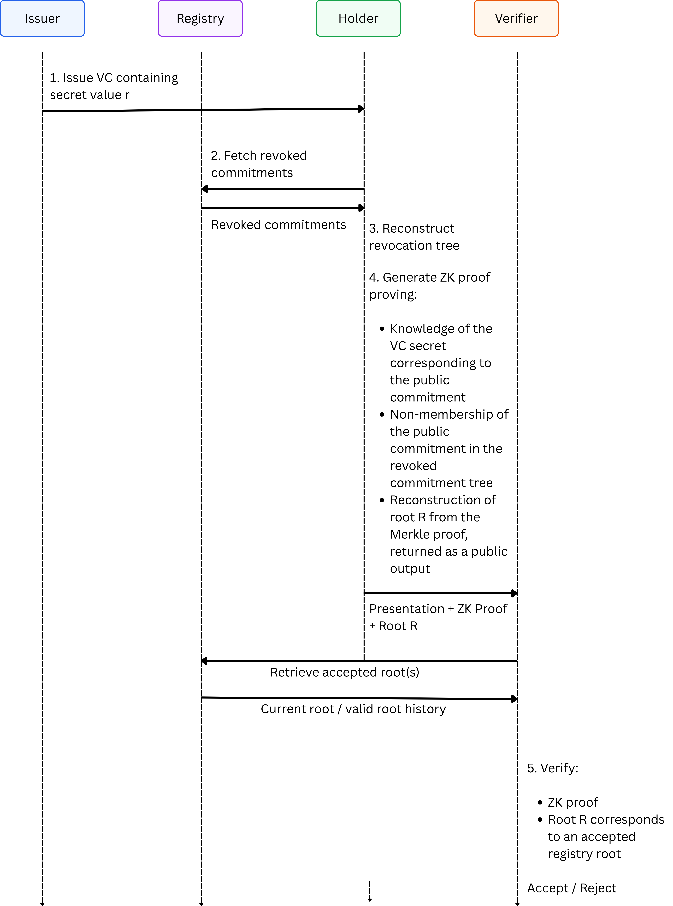

# Privacy-Preserving Revocation for Verifiable Credentials Using Zero-Knowledge Non-Membership Proofs

Revocation is a critical component of any verifiable credential system. Credentials may need to be invalidated because they were issued incorrectly, compromised, or because a holder's authorization has changed.

Many revocation mechanisms introduce privacy risks by exposing credential identifiers or requiring verifiers to contact issuers directly. This article presents a revocation protocol that allows verifiers to determine whether a credential has been revoked without learning which credential is being presented.

The protocol uses zero-knowledge non-membership proofs and a registry containing commitments associated with revoked credentials.

## Design Overview

The protocol involves four entities:

* **Issuer**: Issues credentials and manages revocations.
* **Registry**: Stores revoked commitments and publishes revocation roots.
* **Holder**: Generates zero-knowledge proofs.
* **Verifier**: Verifies credential presentations.

Each credential contains secret revocation material `r`. A public commitment derived from this secret is used as the credential's revocation handle.

Only commitments corresponding to revoked credentials are published to the registry. Non-revoked credentials never appear in the revoked commitment tree.

## Revocation Flow

The following diagram illustrates the revocation verification process.



During presentation, the holder proves knowledge of the credential secret, proves that the corresponding commitment is not present in the revoked commitment tree, and outputs the reconstructed revocation root. The verifier accepts the presentation if the proof is valid and the root corresponds to an accepted registry root.

## Privacy Properties

The verifier never learns:

* The credential secret.
* The credential commitment.
* The credential's position in the revocation tree.

As a result, successful presentations remain anonymous and unlinkable, provided that no additional persistent identifiers are disclosed during presentation.

The issuer is not involved during credential presentation or verification, preventing issuer-side tracking of credential usage.

## Implementation Considerations

### Commitments

A commitment can be derived from a secret value using a cryptographic hash:

```text
C = Poseidon(r)
```

or

```text
C = SHA256(r)
```

Another option is to derive a deterministic [Semaphore V4 identity](https://docs.semaphore.pse.dev/guides/identities#create-deterministic-identities) using `r` as the identity secret and use the resulting identity commitment as the revocation commitment.

Regardless of the implementation, commitments must not reveal information that can identify a credential or holder.

### Revocation Tree

The protocol requires an authenticated data structure capable of supporting non-membership proofs.

Possible options include:

* [LeanIMT+](https://pse.dev/blog/lean-imt-plus-efficient-merkle-tree-for-membership-and-non-membership-proofs)
* [Indexed Merkle Tree](https://eprint.iacr.org/2021/1263.pdf)
* [Sparse Merkle Tree](https://docs.iden3.io/publications/pdfs/Merkle-Tree.pdf)
* Other non-membership tree variants
* Cryptographic accumulators

Among these options, LeanIMT+ is particularly attractive for zero-knowledge applications due to its low circuit complexity and efficient tree operations.

For a broader discussion of Merkle tree based revocation approaches and their tradeoffs, see the article ["Revocation in zkID: Merkle Tree-based Approaches"](https://pse.dev/blog/revocation-in-zkid-merkle-tree-based-approaches).

### Registry

The registry acts as the source of truth for revoked commitments and revocation roots.

Possible implementations include blockchains, centralized servers, or hybrid architectures. While the protocol does not depend on a specific registry implementation, blockchains such as Ethereum provide stronger guarantees around integrity, transparency, and censorship resistance, making them a particularly attractive option for public revocation registries.

The issuer is responsible for revoking credentials by publishing revoked commitments to the registry.

### Root Verification

Verifiers must check that the root returned by the proof corresponds to an accepted registry root.

The strictest approach is to require the proof root to match the latest root published by the registry. However, some systems may allow a bounded history of valid roots to avoid failures caused by legitimate root updates while proofs are being generated or submitted.

A proof can be accepted if:

* The ZK proof is valid.
* The root is either the current root or part of the accepted root history.

This approach is similar to Semaphore's root history mechanism, where recently valid Merkle tree roots can remain usable for a limited period after a tree update. See more context in this [GitHub Issue #98](https://github.com/semaphore-protocol/semaphore/issues/98).

## Reference Implementation

A reference implementation of this revocation mechanism is available in the [zkID repository](https://github.com/privacy-ethereum/zkID/tree/RSA-X.509-Cert).

The implementation demonstrates the use of zero-knowledge non-membership proofs for credential revocation and can serve as a starting point for experimentation and integration into verifiable credential systems.

## Conclusion

By combining commitment-based revocation handles with zero-knowledge non-membership proofs, verifiers can validate revocation status without learning which credential is being presented. The design preserves anonymity and unlinkability while avoiding issuer involvement during credential presentation and verification, and remains compatible with multiple commitment schemes, authenticated set constructions, and registry implementations.
