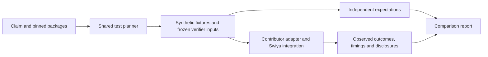

# Proposal: small, complete, testable presentation claims

**Status: design with a bounded implementation in milestone 02.** The executable
claim loader and reference packages are documented in
[the semantics guide](../../integration/semantics/CONTRIBUTING.md). The JSON files
beside this proposal remain design examples, including the unimplemented exact
legacy mapping. The executable synthetic packages have distinct identities. This
proposal replaces the age-centric direction of the first semantics prototype.

**Recommendation.** Standardize a complete, versioned *claim*: the relationship
an accepted presentation claims to establish between an authenticated credential,
private evidence and verifier-given inputs. Compose attribute predicates inside
that claim. Keep implementations, their declared proof coverage, and test
campaigns separate from the claim's meaning.

The first release needs one credential format, a small assertion catalog, three
ordinary predicates, and bounded `all`/`any` composition. It needs no circuit
compiler, trust-policy engine, expression programming language or equivalence
prover.

**1. What a complete claim means**

A representative statement is:

> There exist a credential, its disclosures, holder authorization and any
> required status evidence such that the credential is authentic under the
> given issuer key; the referenced attributes and holder/status references belong
> to that same authenticated credential; metadata and validity requirements hold;
> required status and holder checks hold; the attribute condition is true; and
> the presentation is bound to the given verification request.

The privacy part states what the verifier may learn beyond its own inputs and
the acceptance outcome. A Boolean relation alone does not specify privacy.

“Given issuer” means the verifier/harness supplies the expected key and metadata.
It does not mean our platform decides which issuers deserve trust. Likewise,
time, cutoff dates, status references and request context are supplied inputs.
The provider cannot replace them with values from its own presentation. The
harness freezes the expected context independently for each run.

This is the complete **integration claim**. A separate implementation declaration
identifies which assertions it claims its proof establishes and which its verifier
checks directly. That distinction describes the circuit's claimed statement
without pretending every integration check occurs inside the circuit.

**2. Four small building blocks**

| Building block | What it fixes | Who supplies it |
| --- | --- | --- |
| Format package | Exact signed bytes, authenticated attribute selectors, key/claim encodings, credential metadata, accepted domain and limits | Shared catalog; initially a Swiyu SD-JWT/P-256 package |
| Assertion/predicate catalog | Versioned meanings, argument types, fixture evaluation and test recipes | Shared, reviewed packages |
| Claim JSON | One credential source, bound attributes, verifier inputs, required assertions, Boolean condition and disclosure policy | New claims can be small contributor PRs |
| Implementation manifest | Pinned claim, adapter/artifacts, declared proof/verifier enforcement and operation availability | Contributor |

A new claim using existing operations changes **JSON only**. A new operation
adds a dedicated definition, evaluator/recipe and tests, with explicit catalog
review. It does not require a new branch in the runner. A local experimental
operation can run under its own identity; it cannot impersonate a shared one or
supply authoritative expected answers for an existing claim.

Only explicitly installed, pinned catalog packages can supply shared oracles.
Claim manifests cannot import arbitrary code or fetch an evaluator from a URL.
Experimental packages use distinct local namespaces. Public implementation
registration can remain cursory; promoting new code into the shared oracle
catalog requires ordinary code review, not a cryptographic certification.



The first format package is deliberately specific. It must pin canonical
base64url/JSON handling, JWS algorithm and signed message, disclosure reachability,
duplicate handling, selected claim paths, dates, integers, P-256 key encoding and
input bounds. Authenticating a value without authenticating its path/name and
credential association is insufficient. Predicates only receive attributes from
the authenticated credential handle, never a provider's independent attribute map.

**3. A bounded claim format**

The [complete JSON example](examples/claim-cutoff-status.proposed.json) represents
the legacy Swiyu cutoff-plus-status target. Its skeleton is:

```text
claim
  packages       pinned semantic dependencies
  credential     one authenticated source, named eid
  attributes     aliases pinned to paths and types in that source
  given          typed inputs supplied by the verifier/harness
  require        mandatory named assertions, combined with AND
  where          bounded all/any expression over bound attribute predicates
  release        permitted semantic disclosures and observed opaque channels
```

Each operand is explicitly an attribute, given input, credential handle or typed
constant. There is no interpolation, dynamic path evaluation or provider-defined
lookup. The holder assertion references the expected transcript produced by the
named session assertion through its typed `expected_transcript` output; it cannot
refer to a provider-reported Boolean result. This output is derived by the harness
from the frozen inputs and pinned recipe. Dependencies determine evaluation order,
not the top-level AND semantics. The loader checks references and types and rejects
cycles. v0 permits only catalog-declared output ports, not arbitrary dataflow code.

For both proposed binding recipes, `expected_transcript` has type
`sha256-digest-bytes@1`: exactly the 32 SHA-256 digest bytes. The holder assertion
verifies P-256 ECDSA over this already computed digest, with no extra hash or
string wrapper. Its signature codec comes from the assertion package. A circuit's
scalar encoding of that digest is a separate, pinned conversion, not a different
holder signing message.

The example's given records have these proposed contents; the package must
specify their exact codecs before implementation:

| Input | Content supplied by the harness/verifier |
| --- | --- |
| `issuer` | P-256 public key, expected issuer/key identifiers and permitted credential types |
| `now` | Unix seconds; canonical unsigned decimal string at the generic JSON boundary, converted by the adapter |
| `cutoff` | Exact Gregorian `YYYY-MM-DD` in the legacy package's 1900–2199 domain |
| `session` | Nonce, client ID, response URI, state and query ID; exact UTF-8 and length bounds from the binding recipe |
| `status` | Authoritative opaque snapshot ID, issuer/key association, commitment, epoch/list length and exclusive `validBefore` time; private membership material stays in the fixture/provider |

The status assertion requires `now < validBefore`, along with membership and
association checks. The harness supplies coherent authoritative references;
it does not implement production snapshot discovery or issuer governance. Inputs
needed only by the verifier need not all be sent to the prover. Each assertion
package declares which portions its fixture and provider operations receive.

The first record schemas are closed: no undeclared members, coercions, duplicate
JSON keys or alternate key encodings. `issuer` requires `public_key`, `issuer_id`,
`key_id` and a nonempty `allowed_vcts` set. Public keys are canonical P-256 JWKs
with `kty`, `crv`, `x`, `y`, `kid` and no private `d`; coordinates are canonical
32-byte base64url values and must form a valid point. `key_id` must equal `kid`.
`session` has exactly `nonce`, `client_id`, `response_uri`, `state`, `query_id`;
the legacy recipe uses nonempty UTF-8 strings of at most 4096 bytes each.
`status` requires `id`, `issuer_id`, `key_id`, `subject`, `commitment`, `epoch`,
`list_length` and `valid_before`; the legacy package specifies the existing
commitment encoding and bounds. `subject` is verifier-side association material,
not a newly permitted presentation disclosure. Sets are duplicate-free and have
at most 16 members. Text and identifier equality is exact, with no implicit
case-folding, URI normalization or Unicode normalization. Package schema tests
must pin any remaining legacy-specific byte limits before that package can run.

The initial mandatory-assertion catalog is:

| Assertion | Exact obligation at this abstraction level |
| --- | --- |
| `credential.authentic` | Valid issuer signature under the given key, with authenticated extraction/binding of all referenced attributes and metadata, as defined by the format package |
| `credential.expected-metadata` | Authenticated issuer/key identifiers and credential type satisfy the given expected record |
| `credential.valid-at` | Authenticated `nbf <= given time < exp`; exact integer/time encoding comes from the package |
| `holder.signature-valid` | A valid holder signature under the authenticated credential's holder key over the expected session transcript |
| `presentation.context-bound` | Acceptance is bound to the exact request context under the pinned binding recipe, rather than values chosen by the presentation |
| `status.zero-at-reference` | The credential's authenticated status reference/index is non-revoked in the given authoritative snapshot, including the package's association and freshness rules |

The versioned definitions include required private evidence and conventional
verification rules. They do not specify circuit wires or witness layouts. In
particular, “valid holder signature” is precise; we will not silently rename it
“knowledge of the holder secret.” A different possession relation needs a
different assertion definition.

In particular, the format package defines raw credential/disclosure evidence;
the holder assertion defines signature evidence associated with `eid`'s
authenticated holder key and `expected_transcript`; and the status assertion
defines opening/path evidence associated with `eid`'s authenticated status
reference and the given commitment. These are package-defined semantic inputs,
not free-form witness objects contributed by a provider. A synthetic fixture
factory can construct them without implementing the contributor's circuit.

Every selected `require` assertion is mandatory. Status may be omitted by a
**different claim**, explicitly declaring no status guarantee. It cannot be
disabled by a runtime switch while retaining the same claim identity. Authentication
or holder obligations cannot be bypassed through an OR with a business condition.
Allowing OR between complete credential/issuer alternatives is outside v0.
The initial Swiyu claim family requires the other five catalog assertions;
omitting one is a schema/profile error, not a weaker claim accepted under that
family. A different holder relation or credential family requires its own explicit
catalog definition. These requirements do not purport to cover every ZK system.

The initial ordinary predicates are `value.equals`, `value.in-set`, and
`date.on-or-before`. The existing age evaluator may remain an experimental
additional predicate; it is not the framework's organizing concept.

Initial attribute selectors are fixed top-level names only; the package authenticates
their SD-JWT disclosure paths and supports multiple selected attributes in the
shared fixture/oracle model. The current OpenAC circuit still supports its own
smaller selection. This does not expand its declared capabilities automatically.

For example, the [composition fragment](examples/condition-composition.proposed.json)
expresses:

```text
birthdate <= given cutoff
AND
(nationality IN given allowed set OR residence = given required residence)
```

This is a synthetic demonstration target, not a declaration that OpenAC supports
those attributes or that these field names are an official Swiyu schema. The
credential's mandatory cryptographic assertions still surround the whole tree.
The fragment carries a distinct `swiyu.condition-fragment.v0` schema and must be
rejected by the full-claim loader. It is an explanatory snippet, not an executable
claim or an alternate way to omit the surrounding assertions.

For v0, I propose fixed limits: one credential; at most 16 bound attributes,
16 mandatory assertions, 32 predicate leaves, depth 4, fan-out 2–8 and set size
16. A single predicate is a leaf, not a one-element group. Empty groups and
duplicate sibling expressions are invalid. No NOT, arithmetic expressions,
wildcards, quantifiers, optional attribute presence or cross-credential joins.
Claim JSON and a concrete given-input record are each capped at 64 KiB. These
are editable design limits, not measured performance requirements.

All referenced attributes must be present and well typed before the Boolean
condition is evaluated. A missing residence does not disappear because the
nationality branch is true. This deliberately bounded input domain avoids a
three-valued logic in v0. A future presence-aware rule would need an explicit
new semantic definition.

**4. Identity and comparison**

A claim ID is a readable name. Its `statement_digest` commits to the canonical
claim content, format/operator dependency digests, input domain, binding recipe
and disclosure policy. Reusing the ID with changed semantics fails validation.
A lock file pins package content; neither a mutable import nor the provider's
copy of an operator can redefine the meaning.

The binding assertion is parameterized by an explicitly named, versioned recipe;
the recipe digest is a semantic dependency of the statement. There is no default
recipe or negotiation to the nearest supported one. The example package names
are proposed labels, not an existing lock or a claim that their hashes are pinned
today. Unknown/uninstalled packages stop planning.

The first canonicalization is intentionally modest: strict JSON, no duplicate
keys or non-finite numbers, explicit typed values and deterministic object-key
ordering. Array order stays significant. We do not simplify Boolean algebra or
claim two different trees are equivalent. Contributors can reference the same
published claim to obtain a shared comparison identity.

Keep two other identities separate: `implementation_digest` pins code, artifacts
and declared enforcement; `campaign_digest` pins fixtures, concrete given inputs,
recipes, configuration and execution environment. Changing a corpus does not
change the statement's meaning. Changing a request cutoff changes the test
instance, not the parameterized statement.

Concretely, the implementation identity hashes its executable/source/artifact
pins, manifest, normalized enforcement declaration and observation adapter pin.
The campaign identity hashes the statement identity, harness/recipe/corpus versions,
hashes of realized fixtures/given inputs, seed, timing configuration and pinned
execution environment. It excludes implementation identity so two providers can
run the same campaign. Each result links all three identities and records the
actual run environment and observations separately. Merely recording a seed is insufficient.
Credential secrets and raw witnesses remain local; hashes do not authorize their
publication. Equal statement digests already imply an equal accepted domain.

Full-integration comparisons require the same statement, accepted domain,
campaign and execution target, with all required work included. Declared placement
can differ and must be visible. **Prover-only comparisons additionally require
the same declared proof obligations**; moving a signature check to the verifier
must not appear as a faster prover doing the same work. Unsupported declared
requirements and narrower input domains stay visible; cases cannot be silently
filtered to improve a score.

Measure existing lifecycle stages and full integration boundaries, rather than
claiming to measure each assertion's internal circuit cost. Fixture generation
and oracle evaluation stay outside timed provider stages. Provider-reported
internal timings are supplemental and labeled separately from harness timings.

The first execution target remains entirely laptop-based: Android-emulator
wallet, host prover and host verifier, with each boundary timed and a separate
end-to-end measurement. Reports preserve that topology and emulator configuration.
These are measurements of that actual integration, not predictions of proving
performance on a physical phone. A phone is never a prerequisite for a campaign.

**5. Implementation declarations and evidence**

For every assertion and the condition tree, the implementation declares
`proof`, `verifier`, or `both` as its enforcement location. Wallet prechecks are
recorded separately. A wallet-only check does not satisfy a claim about what an
adversarial presentation's verifier acceptance establishes. Missing/unknown
placement or an unavailable operation is an incomplete declaration, not a
successful verification result. “Mixed” must name the actual subchecks.

For v0, `both` means each location independently enforces the complete obligation.
A split assertion must enumerate every subcheck from a fixed, flat decomposition
published by its catalog definition, with a location for each; inventing arbitrary
subcheck names is invalid. Assertions without such a decomposition cannot be split.
The entire `where` tree, including its Boolean composition, is one enforcement
unit in v0. Per-leaf placement alone cannot claim the tree is enforced. Wallet
prechecks never enter the set of proof obligations used for prover comparison.

These are **claims about enforcement**, not verified circuit facts. The platform
checks declaration completeness and looks for behavioral counterexamples. An
audit remains separate, optional evidence. No source introspection, soundness
proof or automatic circuit-equivalence check is required.

The shared fixture evaluator checks ordinary relations on harness-held synthetic
material. It can validate a credential signature and calculate a condition's
expected truth value. It does not inspect a ZK witness or use the provider's
`verify` result as the oracle. Session binding and replay require multi-run test
recipes, rather than pretending the entire statement is a pure attribute function.

The generator issues a coherent synthetic credential first. Recipes declare
which relationship they change and which dependencies they repair. The evaluator
then confirms the intended expectation before provider execution:

| Test | Fixture construction | Expected observation |
| --- | --- | --- |
| Positive control | Valid credential, holder authorization, status and matching given inputs | Verifier accepts |
| Wrong issuer key | Same credential, different valid given key; also try presentation-supplied key substitution | Verifier rejects; expected key remains authoritative |
| Attribute authentication | Change a disclosure or transplant an authenticated value from another credential without repairing its binding | Rejection; authentication-negative case |
| False condition | Issue and sign a valid credential whose condition is false | Rejection attributable to a semantic-negative case, not merely a broken signature |
| OR coverage | Exercise true/false, false/true, true/true and false/false branches while other requirements hold | First three satisfy OR; only the last fails it |
| Time boundary | Coherent credential at `nbf-1`, `nbf`, `exp-1`, `exp` | Reject, accept, accept, reject when all other requirements hold |
| Holder substitution | Valid issuer credential with the wrong holder signing material | Rejection; distinct from session replay |
| Session substitution | Replay against changed expected nonce/client/response URI/query/policy context covered by the selected recipe | Rejection even if the attribute condition remains true |
| Status substitution | Valid authenticated status references with wrong root/index/association or stale given snapshot | Rejection under the selected status assertion |

Changing one OR leaf does **not** automatically create a negative case. The
whole claim is reevaluated after mutations. Re-signing a changed credential and
leaving its old signature are separate recipes. If a proposed one-fault fixture
also breaks another obligation, the harness repairs it or labels the confounding
factor; it does not invent precise failure attribution from a rejection.

Malformed input deliberately generated by a robustness recipe is expected to be
rejected. A malformed fixture accidentally produced for a valid-domain case is
a harness error. Missing recipe coverage is `not run`, never a passing test.
Start with hand-authored recipes and bounded Boolean assignments; no SAT/SMT
solver or claim of exhaustive generation is needed.

Each case records a stable recipe ID, target assertion/condition, mutation,
repaired dependencies, expected outcome, and expectation basis: trusted fixture
construction, reference evaluation, or a multi-run relation. Observations record
the actual rejecting stage separately. A single rejection remains a case outcome;
it is not proof that the named internal check caused rejection. Confirmation of
the other fixture obligations and a verifier-side observation improves attribution
but still does not certify enforcement placement inside the implementation.

Record wallet refusal, prover failure, transport/schema rejection, verifier
rejection, acceptance and execution error separately. A wallet refusal cannot
be counted as evidence that the verifier rejects an adversarial presentation.
Where no valid attack presentation can be produced, mark that verifier check
not run or inconclusive rather than borrowing the wallet's result.

**6. Differential leakage from the same claim**

The release policy defines the permitted semantic projection of a fixture for
the verifier. Construct paired fixtures with the same given inputs, acceptance
outcome and permitted projection while varying hidden attributes or the branch
that satisfies OR. For example, hold age/issuer/type/session fixed and swap
between nationality-only and residence-only satisfaction. Re-sign credentials
and refresh dependent material as needed.

The format package exports a closed authenticated metadata namespace: `eid.issuer`
is signed `iss`, `eid.key_id` is protected-header `kid`, and `eid.credential_type`
is signed `vct`. These make the example's release references explicit; they are
not untyped extra attributes. The selected type may reveal information even when
the verifier supplied an allowlist of types, so it must be declared as released.

The observation adapter has a pinned, catalog-reviewed mapping from the actual
wire envelope to logical outputs plus a complete raw-byte capture. It must account
for every structured field as a permitted value, a public protocol constant/given
input, or an observed opaque channel. Unknown fields are reported; an implementation
cannot make them disappear by omitting them from `public_outputs`. Unsupported
wire decoding makes structured leakage coverage unavailable, rather than passing
an empty projection. Reference projections are computed by the harness. The same
policy applies to acceptance and rejection; the first paired campaign can be
limited explicitly to successful presentations.

Derived public values are explicit too. `release.protocol_derived` references
pinned catalog recipes whose closed output maps use only given inputs, protocol
constants and already permitted semantic values. The harness computes and checks
those outputs exactly; an arbitrary provider-defined digest is not an allowed
public value. In the legacy example, `swiyu.public-context@0` covers the existing
ten public values: expression result, issuer-key coordinates, challenge scalar,
cutoff, current time, and two limbs each for metadata and status commitments,
including their exact wire encodings. The new recipe `claim.context@1` exports
only its expected 32-byte digest through this mechanism. A claim using that
public value must list the recipe in `release.protocol_derived`. Unknown fields
remain findings even when the provider calls them commitments or hashes.

Observe the actual verifier-visible envelope, public values, errors, proof bytes,
lengths, structure and timings. Provider-declared field mappings cannot erase raw
observations. Structured outputs must match the permitted projection; extra
fields or a branch selector are failures. An opaque proof channel remains under
observation: repeatability, embedded-value canaries, length changes and bounded
statistical experiments can reveal counterexamples. Opaque does not mean exempt.

Randomized proofs need not be byte-equal. Different bytes alone are not evidence
of leakage, and no detected difference is not a proof of zero knowledge. Time
and distribution tests need repeated controls and explicit inconclusive outcomes.
Broad network observation, adaptive-query privacy and physical side channels stay
outside v0. Wallet/prover diagnostic logs have a separate observation scope; they
are not silently treated as verifier-visible.

**7. Concrete Swiyu mapping and migration**

The existing source uses **inclusive birthdate <= supplied cutoff**, with dates
in 1900–2199, rather than computing age from a reference date. Its validity rule
is `nbf <= currentTime < exp`. Its holder signs a domain-separated encoding of
nonce, client ID, response URI, state, query ID, profile, cutoff, current time and
status snapshot. The verifier reconstructs expected public inputs. These belong
in a pinned legacy package and binding recipe; we must not silently substitute
the new age oracle or a different transcript.

The initial catalog should also define `claim.context@1` for the synthetic
composition demonstration: SHA-256 of the UTF-8 domain tag `swiyu-claim-v1`
followed by a zero byte, a four-byte big-endian byte length, and the canonical
JSON bytes of `{statement_digest, given}`. Canonicalization is the strict rule
above; uint64 quantities use their canonical decimal-string codecs. This binds
all concrete given inputs and the statement identity. The verifier computes the
expected digest independently; providing that digest to the prover does not let
the prover choose its value. It can also avoid sending verifier-only record
members as individual fields.

The synthetic composition fragment must be installed in a new full claim using
this recipe and all the surrounding required assertions. It must not be pasted
into the legacy example while retaining the old binding recipe, which does not
cover the new nationality/residence parameters. Both recipes can live in the
initial catalog; neither implies existing circuit support. Proof verification
keys and artifacts remain implementation pins, not values accepted from the
presentation.

Grounding: SDK `src/swiyu-zkp/parser.ts:223–267`, `wallet.ts:156–201`,
`challenge.ts:13–45`, `public-context.ts:36–105`, and `sidecar.ts:149–203` under
`components/zkid/wallet-unit-poc/openac-sdk`. These establish host behavior and
public-input construction; they do not establish circuit constraint coverage.
The prebuilt `dist/swiyu-zkp/index.js:650–662` also checks the issuer signature.
This corrects the earlier overly narrow description of preparation: it includes
signature verification against the supplied key, while issuer trust selection
and proof generation are separate.

The proposed layout is small:

```text
integration/semantics/
  formats/swiyu-sd-jwt-es256-v0/   definition, fixture/extraction support, tests
  assertions/swiyu-v0/            definitions, relation checks, mutation recipes
  predicates/core-v1/             equals, in-set, date-on-or-before
  claims/                        complete declarative claim JSON
  catalog.lock.json               pinned packages and statement identities
  ...generic loader, evaluator and planner...
integration/providers/<name>/     contributor manifest and adapter
```

Implement in reviewable steps, with a failing-test gate before each source change:

1. Claim loader, references, types, bounds and dependency pins. Reject unknown
   operations, duplicate IDs, illegal OR guards and changed definitions.
2. Authenticated attribute handles and the first format package. Test disclosure
   transplantation, duplicate/path confusion and given-key substitution.
3. Generic predicate tree plus the three initial predicates. Demonstrate the
   composition fragment with synthetic signed fixtures and no runner special cases.
4. Full-claim assertion evaluation and named recipes. Keep oracle, fixture errors
   and verifier observations distinct; cover time, holder, session and status.
5. Manifest enforcement declarations and claim-driven runner selection. A new
   claim using existing operators must require only a JSON file and catalog entry.
6. One real OpenAC full-claim campaign when proving prerequisites are available;
   retain unavailable and unaudited claims explicitly until then.
7. One paired OR-branch leakage campaign and report, plus comparison grouping that
   distinguishes full integration from equal-obligation prover work.

Each step should remain within the existing few-hours human review budget; split
the assertion recipes if needed. EPFL mapping follows actual reproduction and
compatibility inspection. Its status coverage must not be assumed.

**Acceptance criterion.** We can add a second complete claim by changing only
dedicated declarative files, select the corresponding empirical checks, and show
which cryptographic and attribute obligations were tested—without adding another
age-specific path or claiming that passing certifies the circuit.
