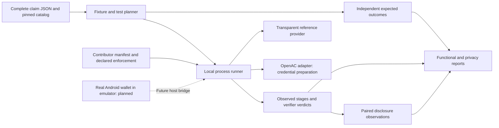

# Local evaluation boundary

The runner owns process lifecycle and result validation. Each provider owns its
credential conversion, prepared state and cryptographic implementation. OpenAC
stays behind its adapter; the new runner does not import the OpenAC SDK.

The semantic registry defines complete claims: authenticated credential
attributes, mandatory cryptographic assertions, typed given inputs, a bounded
AND/OR predicate tree, and permitted disclosures. The planner derives expected
answers from those definitions and synthetic evidence before calling a provider.
The original age-only evaluator remains a separate compatibility surface.

The transparent reference provider executes actual conventional cryptographic
checks but generates no ZK proof and exposes synthetic credential evidence.
Privacy findings are expected. It shares the reference evaluator, so its
functional results demonstrate harness mechanics rather than independently
validating a contributor's implementation. A fault mode that accepts everything
must disagree with the same precomputed negative cases. The older non-cryptographic
test stub remains available for process-lifecycle tests.

The executable flat SD-JWT and SHA-256 Merkle status packages have distinct
`platform.*` identities. They do not silently replace the exact OpenAC legacy
relation. Statement, implementation and campaign identities distinguish shared
meaning, contributor artifacts/declared enforcement, and the actual workload.

The OpenAC adapter currently calls the real SDK for parsing, issuer-signature
verification under the supplied key, and precomputation.
Unavailable proving or verification produces an execution error. A completed
preparation stage does not establish issuer trust, successful proving, or proof
verification. The existing SDK and the wallet/verifier integration are retained
as regression references; their full separation is still pending.

The future Android bridge will use the actual wallet in an emulator, with
synthetic credentials and host proving. Its benchmarks will identify where
each stage ran and separate native prover measurements from emulator/service
contention. No stage in the planned workflow requires a physical phone.
