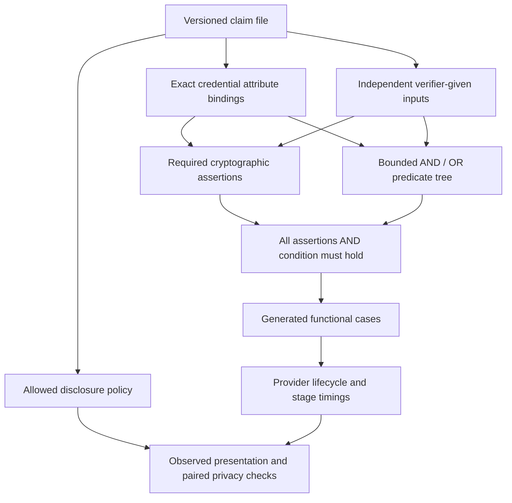

# Milestone 02: complete claims and local semantic campaigns

This milestone replaces the age-only direction with a bounded language for
complete presentation claims. The executable examples, reference cryptography,
fixture generation and provider campaign run locally on a laptop.

## Claim model

The first package checks issuer signatures and authenticated attributes, expected
issuer/type metadata, validity at a given time, holder authorization, binding to
the complete given record and, when declared, non-revocation against a given
status snapshot. These assertions apply outside the Boolean condition. An OR
branch cannot bypass them.

An attribute binding names one credential, its exact disclosure path and its
type. Predicates use these aliases and typed verifier-given parameters. The
catalog contains equality, set membership and inclusive date comparison. The
examples cover a date cutoff, a composed date/country condition and an age-free
clearance condition. New combinations of these operations require a claim file,
not a new runner branch.

## Deliberate limits and decisions

- One credential; flat scalar attributes; at most 16 attributes, 32 leaves and
  four Boolean levels. Groups contain two to eight children. Claims and given
  records are capped at 64 KiB.
- All declared attributes are required and checked before Boolean evaluation.
  No implicit normalization, coercion, missing-value logic, NOT, arithmetic,
  nested paths or joins between credentials.
- Comparison parameters are given inputs in the executable version. The earlier
  design document includes possible constant operands; they are not implemented.
- `platform.sd-jwt-es256@1` and `platform.presentation@1` name the synthetic
  reference format. Its flat SD-JWT domain, context digest and SHA-256 Merkle
  status relation are distinct from the exact legacy OpenAC profile.
- Issuer validity is relative to the supplied key and expected metadata. The
  platform does not implement issuer governance or decide which issuer to trust.
- A support declaration names every obligation and its enforcement location.
  It is a contributor claim, not a certificate of circuit correctness.
- Statement, implementation and campaign identities are separate. Semantic
  source pins are checked before evaluation and updated only by an explicit
  maintenance command. Conservatively, a semantic source refactor changes the
  statement identity.

## What the local demonstration establishes

The planner creates signed synthetic credentials and derives expected outcomes
before invoking the provider. It generates Boolean examples and failures of the
declared cryptographic assertions, reevaluates the full reference claim and
records omitted recipes explicitly. Candidate generation is bounded and is not
an exhaustive solver for arbitrary Boolean expressions.

The runner uses initialize, prepare, present, verify and cleanup through the
existing JSONL provider boundary. Verification receives independently frozen
given inputs. A deliberately accepting provider must fail negative cases without
changing the expected answers. Functional outcomes and privacy findings remain
separate in the report.

Differential comparisons use actual presentation bytes from cases with the same
statement, given record, reference public values, observed result and stage.
Public issuer/key/type values come from the authenticated fixture. Cases whose
projection cannot be authenticated are excluded from pairing and counted. The
decoder checks emitted values against this projection; permitted disclosure does
not require a field to be emitted. Matching derived context fields are public.
The report records pair identities, byte lengths, field counts and findings.
Opaque byte differences alone are inconclusive, and unavailable decoding stays
visible as missing coverage.

The included provider is transparent and shares the reference evaluator. Its
credential disclosure is an expected finding and provides a control for the
leakage analyzer. Passing this provider's functional tests establishes harness
behavior, not independent evidence about a contributor's circuit.

## Try it

From the repository root, use the environment and commands in
[the executable guide](../../integration/semantics/README.md). The current
generated report is `artifacts/platform-semantics/report.html`; the age-free
report is `artifacts/platform-semantics-clearance/report.html`.

The [contributor guide](../../integration/semantics/CONTRIBUTING.md) explains
attribute bindings, package semantics, release declarations and support. Local
experiments need no publication or PR. Optional audit evidence remains separate
from campaign results.

## Integration boundary

The original age API, neutral runner and OpenAC preparation adapter remain
available. The Python reference parser also authenticates a portable public
fixture generated by the existing Node SDK. This is a format interoperation
check, not a complete OpenAC proof integration.

Exact OpenAC public inputs/proofs, EPFL integration, the Java verifier and wallet
bridge, OID4VP end-to-end campaigns, Android emulator execution and CI publication
remain subsequent work. The reported timings are desktop harness measurements;
no phone or Android performance measurements were made. Statistical timing
leakage analysis is explicitly not run.

Stage times are totals across the campaign, not per-proof latency. The end-to-end
interval includes harness work and process lifecycle overhead. It is useful for
checking measurement plumbing, not ranking real proof implementations.

## Test and review process

Separate failing-test gates preceded the core, cryptography and campaign
implementations. The master strengthened regression coverage and used separate
Cursor review contexts for the cryptographic and campaign boundaries. Review
found and led to fixes for forged claim admission, support-name coupling and
misclassification of public inputs as private material.

Some intermediate worker hardening edited implementation before its new tests,
despite the requested ordering. Those changes were subsequently tested and
reviewed; they are not recorded as strict TDD. Later repairs used separate
test-only gates before implementation was authorized. See the
[worker ledger](worker-ledger.md) for execution evidence and resource accounting.

## Accepted validation

| Suite | Passing tests |
| --- | ---: |
| Complete semantics suite, including the original age tests | 202 |
| Platform runner suite, including original lifecycle tests | 66 |
| Existing OpenAC preparation adapter | 20 |
| Existing SDK mobile-runtime/sidecar contracts | 17 |
| Total, without counting repeated runs twice | 305 |

The final Python suites and all local example workflows passed after the last
repair. Node regression evidence covers unchanged adapter/SDK code. The composed
campaign has 12 executed cases and 16 eligible comparisons; the injected
accept-all provider fails eight negative cases while retaining four passing
positive cases and unchanged expected answers. The hidden-field injection is
also detected. Repeated runs preserve the campaign identity, stale pins fail,
and missing dependencies produce an actionable error.

The independent reviewer closed the final public-projection, context-alias and
malformed-presentation findings. The HTML report was opened in a browser and its
readable claim, coverage, stage units and case table inspected. Detailed result
metadata is in [milestone-02-validation.json](milestone-02-validation.json).

The reference provider exposes its credential fixture by design. It also emits
an `acceptance: null` placeholder, which the value checker reports as a structure
mismatch. Deliberately invalid context cases produce derived-value mismatches.
These observations are distinct from the functional verifier verdict; the
report does not represent this provider as privacy-preserving. Each example has
one deliberately wrong-issuer case whose public projection cannot be
authenticated; it is counted and excluded from pairing.

## Resource and cleanup outcome

The maximum observed owned RSS was 1,586.69 MiB under the 2 GiB cap. Free disk
remained above 23.37 GiB, above the 16 GiB reserve. The final sampled memory-free
percentage was 34%; machine-wide swap was about 15.1 GiB. These machine-wide
values include other applications and are not all attributed to this task.

All owned worker jobs and temporary HTTP previews were stopped. The duplicate
temporary Python environment, download cache and redundant copied fixtures were
removed. The repository's ignored `.venv` remains usable and has no links into
the deleted scratch environment. Raw worker traces were compressed with a
checksum-verified readback; minimal reports, probes and validation evidence are
retained in the run-owned temporary directory. No unrelated temporary files or
applications were touched.
